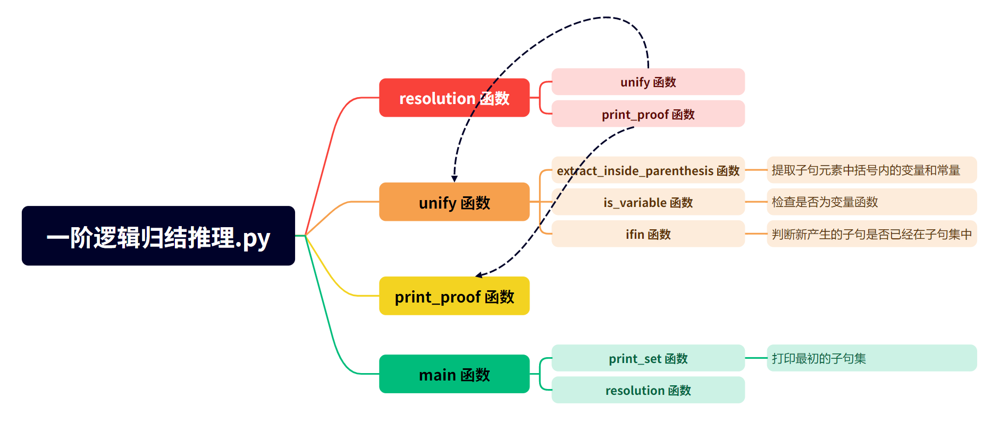
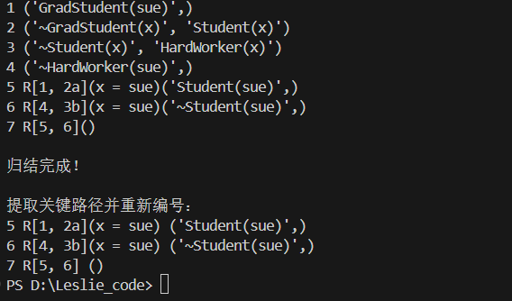
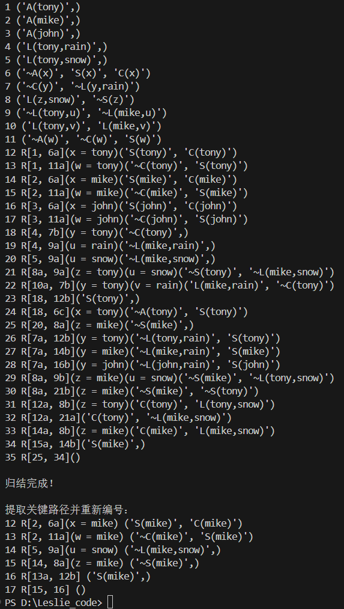
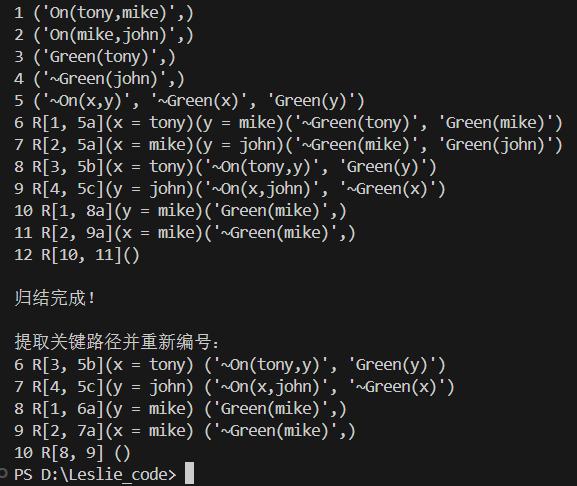

# 人工智能实验报告 第四周

姓名: 陈泽义  学号:23336050

---

### 一.实验题目
- 实现一阶逻辑归结推理算法，归结得到空子句证明 $KB \land \neg \alpha$ 不可满足，从而证明 $KB \models \alpha$ 
### 二.实验内容

#### 1.算法原理
- 储存数据结构：
  - 子句：`tuple`
  - 子句集：`dict`
- 函数结构：
  - 主要函数三个:
    - `unify`函数：实现子句之间的归结
    - `resolution`函数：利用循环嵌套遍历子句集直到归结出空子句
    - `print_proof`函数：实现回溯，找到推理过程中的关键路径，剔除没用的归结，并重新编号
  - 另外还有实现小功能的函数，大概关系如下：
        
  - `main` 函数作为入口
  - 另外新增优化函数`if_end`，见 [3.创新点&优化](#3创新点优化)
- 实现思路：
  - **总体而言**：利用循环嵌套不断进行归结产生新子句，直到生成空子句则停止循环，再利用回溯算法找到关键路径，将结果打印出来
  - **归结函数(`unify`)**
    - 利用两个循环嵌套，在传入的两个子句(`i,j`)中找到可以归结的子句元素
    - 可以进行归结的逻辑判断是：
      - 1. 判断谓词名称是否相同
      - 2. 检查是否一个为肯定一个为否定
      - 3. 提取变量和常量并检查数量是否相等【这里规定变量为长度为1的字母，常量为长度大于1的单词】
      - 4. 检查是否有两个常量或者两个变量不相同的情况
    - 归结的过程：
      - 首先调用`is_variable`函数划分常量和变量构造字典映射
      - 删去子句`i,j`中归结后应该删去的元素
      - 将子句`i` / `j`中的变量替换为常量
      - 合并两个子句形成新子句，判断子句集中是否已经存在该子句，若不存在则加入（同时利用`dict`结构记录归结的路径：记录两个父句、归结元素所在位置以及变量映射）
  - **回溯函数(`print_proof`)**
    - 从空子句开始，利用队列结构，根据记录的路径回溯
    - 根据原来的编号先进行一次排序
    - 重新编排子句的编号得到新的推理路径编号映射
    - 打印关键路径
#### 2.关键代码展示
##### 2.1 `unify`函数
- 提取谓词时巧妙利用`split`函数：
    ```python
    ...

    w1_1 = i[m].split("(")[0]
    w1_2 = j[k].split("(")[0]

    ...
    ```
- 利用`startswith`函数解决谓词是否相同判断以及是否为否定的判断：
    ```python

    ...

    # 检查谓词是否相同（忽略否定符号）
    pred1 = w1_1[1:] if w1_1.startswith("~") else w1_1
    pred2 = w1_2[1:] if w1_2.startswith("~") else w1_2

    ...

    # 检查是否一个是肯定一个是否定
    neg1 = i[m].startswith("~")
    neg2 = j[k].startswith("~")

    ...

    ```
- 为了方便在字符串上实现变量替换为常量，先将`tuple`转为`list`，实现替换后再转回`tuple`
    ```python
    ...

    new_i = list(i[:m] + i[m + 1 :])
    new_j = list(j[:k] + j[k + 1 :])

    new_clause = []

    ...

    new_tuple = tuple(new_clause)

    ```
- 利用`replace`函数实现变量替换为常量，并考虑两种情况：1. 括号内只有一个元素；2. 括号内有多个元素
    ```python
    ...

     for item in new_i:
        new_item = item
        for var, val in var_map.items():
            new_item = new_item.replace(f"({var}", f"({val}").replace(
                f",{var}", f",{val}"
            )  # 两种情况
        new_clause.append(new_item)

    ...
    ```
##### 2.2 `print_proof`函数
- 如何高效的回溯？
  - 利用队列结构，在此基础上设置`set`结构记录已经访问过的子句，避免重复访问
    ```py
    ...
    queue = [()]
    visited = set()
    ...
    ```
- 如何排除最初的子句避免编号混乱？
  - 在添加到`proof_steps`时，判断是否为最初的给定子句，若是则不添加
  - 利用该子句是否在之前归结时映射表`parent`中（因为`parent`的`key`不会记录最初的子句）
    ```py
        ...
        if current in parents:  # 这一条件筛去了初始的子句
            ...
    ```
- 如何在打印的时候使用新的编号？
  - 构建新的编号映射`new_numbering = {}`，设置新归结子句的编号从`size + 1`开始
    ```py
    ...
    new_numbering = {}
    next_id = size + 1
    ...
    ```
  - 构建所有出现的子句集，注意也要剔除最初子句
  - 然后按照原先的顺序进行排序（相对顺序是一定的）
  - 再一个个绑定新编号
    ```py
    ...
    # 收集所有在证明路径中出现的子句
    all_clauses_in_proof = set()
    for current, p1, p2, _, _, _ in proof_steps:
        if myset[current] > size:# 剔除最初的给定子句
            all_clauses_in_proof.add(current)
        if myset[p1] > size:# 剔除最初的给定子句
            all_clauses_in_proof.add(p1)
        if myset[p2] > size:# 剔除最初的给定子句
            all_clauses_in_proof.add(p2)

    # 按照原始编号顺序分配新编号
    sorted_clauses = sorted(all_clauses_in_proof,
    key=lambda clause: myset[clause])
    for clause in sorted_clauses:
        new_numbering[clause] = next_id
        next_id += 1
    ...
    ```
#### 3.创新点&优化
- 优化：
  - **最短子句优先归结**：由于较短子句容易产生空子句，所以在归结时优先选择较短的子句进行归结
    ```py
    ...
    while True:
        # 按子句长度排序（从短到长）
        clauses = sorted(myset.keys(), key=lambda clause: len(clause))
        for i in range(len(clauses)):
            for j in range(len(clauses)):
                ...
    ```
  - 归结产生的新子句会有重复的元素，再下一次利用此新的子句做新的归结时浪费时间，所以需要**去除重复元素**。怎么去除相同的元素呢？利用字典！
    ```py
    ...
    # 去除重复元素
    new_clause = list(dict.fromkeys(new_clause))
    ...
    ```
  - 在`resolution`函数中，跳出归结循环的判断条件如果只是判断是否有空子句，则归结步骤中产生的长度为  $1$ 的可以直接归结产生空子句的子句会被忽略，所以扩写`if () in myset`判断条件，增加判断函数`if_end`：
    ```py
    def if_end(myset):
        unit_clauses = [clause for clause in myset.keys() if len(clause) == 1]
        for i in range(len(unit_clauses)):
            for j in range(i + 1, len(unit_clauses)):
                clause_i = unit_clauses[i]
                clause_j = unit_clauses[j]

                unify(clause_i, clause_j)

                if () in myset:
                    return True
        return False
    ``` 
    增加了对长度为 $1$ 的可归结子句的判断，大大提高了归结的效率
### 三.实验结果及分析
#### 1.实验结果展示示例
- 共有三个案例：
  - $a.$ 
    ```py
    # 用例 1
    tuple_1 = ("GradStudent(sue)",)
    tuple_2 = ("~GradStudent(x)", "Student(x)")
    tuple_3 = ("~Student(x)", "HardWorker(x)")
    tuple_4 = ("~HardWorker(sue)",)

    myset = {
        tuple_1: 1, 
        tuple_2: 2, 
        tuple_3: 3, 
        tuple_4: 4
    }
    ```
  - $b.$ 
    ```py
    # 用例2
    tuple_1 = ("A(tony)",)
    tuple_2 = ("A(mike)",)
    tuple_3 = ("A(john)",)
    tuple_4 = ("L(tony,rain)",)
    tuple_5 = ("L(tony,snow)",)
    tuple_6 = ("~A(x)", "S(x)", "C(x)")
    tuple_7 = ("~C(y)", "~L(y,rain)")
    tuple_8 = ("L(z,snow)", "~S(z)")
    tuple_9 = ("~L(tony,u)", "~L(mike,u)")
    tuple_10 = ("L(tony,v)", "L(mike,v)")
    tuple_11 = ("~A(w)", "~C(w)", "S(w)")

    myset = {
        tuple_1: 1,
        tuple_2: 2,
        tuple_3: 3,
        tuple_4: 4,
        tuple_5: 5,
        tuple_6: 6,
        tuple_7: 7,
        tuple_8: 8,
        tuple_9: 9,
        tuple_10: 10,
        tuple_11: 11,
    }
    ```
    - $c.$ 
    ```py
    # 用例 3
    tuple_1 = ("On(tony,mike)",)
    tuple_2 = ("On(mike,john)",)
    tuple_3 = ("Green(tony)",)
    tuple_4 = ("~Green(john)",)
    tuple_5 = ("~On(x,y)","~Green(x)","Green(y)",)

    myset = {
        tuple_1: 1,
        tuple_2: 2,
        tuple_3: 3,
        tuple_4: 4,
        tuple_5: 5,
    }

    ```
- 实验结果展示：
  - 用例 1
    
  - 用例 2
    
  - 用例 3
    


#### 2.评测指标展示及分析
- **评测指标**：
  - **正确性**：能够正确的推理出空子句
  - **效率**：能够在较短时间内推理出空子句（最长的*用例 2* 推理步骤总长为  $35$ ，*用例 1* 推理步骤总长为  $7$ ，*用例 3* 推理步骤总长为  $10$ ）
  - **时间复杂度**：(只分析两个占资源最多的函数)
    - `resolution` 函数的时间复杂度为  $O(n^2)$ ，其中  $n$ 为子句集的长度
    - `unify` 函数的时间复杂度为  $O(|i| \times |j|)$ ，其中  $|i|,|j|$ 分别为两个子句的长度
- **分析**：
  - 在处理不可满足公式时，最坏情况下可能不会终止
  - 或许字符串的处理并不如其他数据结构高效简洁，可以考虑使用其他数据结构
  - 如果数据量较大，搜索`dict`结构效率可能会降低
### 四.参考资料
> - https://www.runoob.com/python/att-dictionary-fromkeys.html