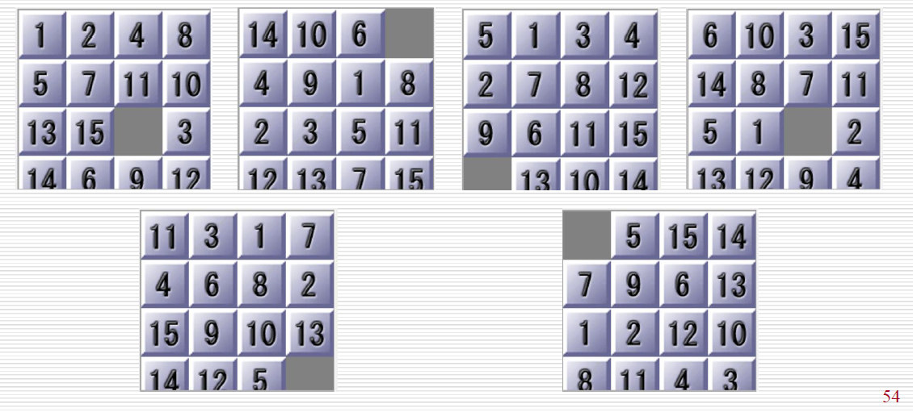

## 人工智能实验报告 实验三
---

[toc]

---


### 一.实验题目
- 本次实验基于 搜索原理 学习有:
  - 任务：`15-puzzles` 问题
    - 编写程序，使用 `A*` 与 `IDA*` 算法解决 `15-Puzzle` 问题
### 二.实验内容
#### 1. 算法原理
##### (1) A* 算法
- `A*` 算法可以看成是 `BFS` 算法的升级版，在原有的 `BFS` 算法的基础上加入了启发式信息。
- 启发式搜索：利用**评估函数**
    $$
    f(x) = h(x) + g(x)
    $$
    评判一个节点的重要性，使得搜索能够朝着更有希望的方向进行。
##### (2) IDA* 算法
- `IDA*` 也叫 “迭代加深A*” 搜索算法，因为不用维护表，所以比 `A*` 算法有空间上的优势。同样的，该算法会在每一步对所有可访问节点进行评估，对应的最小可估价函数值大于某个给定的阈值的时候，将会剪枝。
#### 2. 关键代码展示
> - 记录`15-puzzles`的数据结构：`tuple`
> - 采用堆排序，利用`heapq` 优先队列，使用最小堆实现
> - 启发函数在曼哈顿距离的基础上增加了线性冲突的计算（仍然可以保持最优解）
> - 代码结构：
    
- <svg width="16" height="16" viewBox="0 0 16 10" xmlns="http://www.w3.org/2000/svg" fill="currentColor"><path fill-rule="evenodd" clip-rule="evenodd" d="M4 6h8v1H4V6zm8 3H4v1h8V9z"/><path fill-rule="evenodd" clip-rule="evenodd" d="M1 4l1-1h12l1 1v8l-1 1H2l-1-1V4zm1 0v8h12V4H2z"/></svg> **MOVE_TABLE**
    ```py
    MOVE_TABLE = [[] for _ in range(16)]
    for i in range(16):
        x, y = i % 4, i // 4
        if x > 0:
            MOVE_TABLE[i].append(-1)  # 左
        if x < 3:
            MOVE_TABLE[i].append(1)  # 右
        if y > 0:
            MOVE_TABLE[i].append(-4)  # 上
        if y < 3:
            MOVE_TABLE[i].append(4)  # 下
    ```
    - 为了**节省生成子状态时多次重复计算空格的移动**，生成一个全局移动表，记录每个 $4 \times 4$ 的表格可以移动的位置（ 由于我记录原始`15-puzzles`的数据结构是一维`tuple`，所以直接坐标`±1`和`±4`即可）。
$\space $  
- <svg width="16" height="16" color = purple viewBox="0 0 15 14" xmlns="http://www.w3.org/2000/svg" fill="currentColor"><path d="M13.51 4l-5-3h-1l-5 3-.49.86v6l.49.85 5 3h1l5-3 .49-.85v-6L13.51 4zm-6 9.56l-4.5-2.7V5.7l4.5 2.45v5.41zM3.27 4.7l4.74-2.84 4.74 2.84-4.74 2.59L3.27 4.7zm9.74 6.16l-4.5 2.7V8.15l4.5-2.45v5.16z"/></svg> **generate_next_state** 函数
  ```py
  def generate_next_states(board):
    global MOVE_TABLE
    results = []
    idxz = board.index(0)  # 空格位置
    l = list(board)  # 转换为列表以便修改
    for m in MOVE_TABLE[idxz]:
        l[idxz], l[idxz + m] = l[idxz + m], l[idxz]  # 交换空格和目标位置
        results.append(tuple(l))  # 记录移动的数字
        l[idxz + m], l[idxz] = l[idxz], l[idxz + m]  # 还原交换
    return results
  ```
  - 由于全局已经有空格移动的 <svg width="16" height="16" viewBox="0 0 16 10" xmlns="http://www.w3.org/2000/svg" fill="currentColor"><path fill-rule="evenodd" clip-rule="evenodd" d="M4 6h8v1H4V6zm8 3H4v1h8V9z"/><path fill-rule="evenodd" clip-rule="evenodd" d="M1 4l1-1h12l1 1v8l-1 1H2l-1-1V4zm1 0v8h12V4H2z"/></svg> **MOVE_TABLE**，直接通过`idxz`索引到空格的坐标，然后交换空格和目标位置，记录移动的数字。最后还原交换。（`tuple` 是不可变的，所以需要转换为列表进行修改）
$\space $
- <svg width="16" height="16" color = purple viewBox="0 0 15 14" xmlns="http://www.w3.org/2000/svg" fill="currentColor"><path d="M13.51 4l-5-3h-1l-5 3-.49.86v6l.49.85 5 3h1l5-3 .49-.85v-6L13.51 4zm-6 9.56l-4.5-2.7V5.7l4.5 2.45v5.41zM3.27 4.7l4.74-2.84 4.74 2.84-4.74 2.59L3.27 4.7zm9.74 6.16l-4.5 2.7V8.15l4.5-2.45v5.16z"/></svg> **A_star** 函数
    ```py
    def A_star(init_board):
        global goal_tuple
        # 统计信息
        start_time = time.time()
        nodes_expanded = 0

        # 采用堆进行排序
        myheap = []
        visited = set()
        parent = {}
        parent[init_board] = None
        moves = {}
        moves[init_board] = 0

        heapq.heappush(myheap, (0, init_board))

        while myheap:
            _, now_board = heapq.heappop(myheap)

            # check_end_state
            if now_board == goal_tuple:
                end_time = time.time()
                path = record_path(parent, init_board)
                result = {
                    "path": path,
                    "path_len": len(path),
                    "expanded_nodes": nodes_expanded,
                    "time": end_time - start_time,
                }
                return result

            visited.add(now_board)
            nodes_expanded += 1

            if len(visited) % 10000 == 0:
                gc.collect()
            # 生成下一层
            for next_board in generate_next_states(now_board):
                new_g = moves[now_board] + 1 
                if next_board not in moves or new_g < moves[next_board]:
                    moves[next_board] = new_g
                    new_h = manhattan(next_board) + linear_conflicts(next_board)
                    new_f = new_g + new_h

                    heapq.heappush(myheap, (new_f, next_board))
                    parent[next_board] = now_board  # 记录父节点             
        return None
    ```
  - 1. 统计信息有：`expanded_nodes`、`time`
  - 2. 采用堆排序，`myheapq` 是一个优先队列，使用最小堆实现。排序的依据是 `f(n)`，即 `g(n) + h(n)`
  - 3. `visited` 集合用于存储已经访问过的节点，为了防止运行时候内存溢出，设置了每 10000 次访问就进行一次垃圾回收（`gc.collect()`）
  - 4. `parent` 字典用于记录每个节点的父节点，以便在找到目标节点后回溯路径。`moves` 字典用于记录每个节点的移动步数（`g(n)`）
  - 5. 整体实现思路与 `BFS` 类似，只是添加进队列的时候利用了 `heapq` 进行自动排序，保证了启发值小的节点优先访问。
$\space$ 
- <svg width="16" height="16" color = purple viewBox="0 0 15 14" xmlns="http://www.w3.org/2000/svg" fill="currentColor"><path d="M13.51 4l-5-3h-1l-5 3-.49.86v6l.49.85 5 3h1l5-3 .49-.85v-6L13.51 4zm-6 9.56l-4.5-2.7V5.7l4.5 2.45v5.41zM3.27 4.7l4.74-2.84 4.74 2.84-4.74 2.59L3.27 4.7zm9.74 6.16l-4.5 2.7V8.15l4.5-2.45v5.16z"/></svg> **IDA_star** 函数
    ```py
    def IDA_star(initial_board):
        global goal_tuple
        # 统计信息
        start_time = time.time()
        nodes_expanded = 0

        path = []
        visited = set()
        visited.add(initial_board)
        path = [initial_board]
        parent = {}
        parent[initial_board] = None

        bound = manhattan(initial_board) + linear_conflicts(initial_board)
        
        def DFS(moves,bound):
            nonlocal nodes_expanded
            now_board = path[-1]

            # 计算启发值
            now_f = moves + manhattan(now_board) + linear_conflicts(now_board)
            if now_f > bound:
                return (False,now_f)
            if now_board == goal_tuple:
                return (True,0)
            
            min_value = float("inf")
            for next_board in generate_next_states(now_board):
                if next_board in visited:
                    continue
                nodes_expanded += 1
                visited.add(next_board)
                path.append(next_board)
                parent[next_board] = now_board  # 记录父节点
                result = DFS(moves + 1, bound)
                if result[0]:
                    return (True,0)
                min_value = min(min_value, result[1]) # 一轮结束了，记录这一轮最小的bound
                path.pop()
                parent.pop(next_board)  # 删除父节点记录
                visited.remove(next_board)
            return (False,min_value)
        while True:
            state, new_bound = DFS(0, bound)
            if state:
                end_time = time.time()
                result = {
                    "path": record_path(parent, initial_board),
                    "path_len": len(path) - 1,
                    "expanded_nodes": nodes_expanded,
                    "time": end_time - start_time,
                }
                return result
            bound = new_bound
            if bound == float("inf"):
                break
        return None
    ```
    - 1. 统计信息有：`expanded_nodes`、`time`
    - 2. 利用`path`列表来模拟栈
    - 3. `visited` 集合用于存储已经访问过的节点，避免重复访问【环检测】，`parent` 字典用于记录每个节点的父节点，以便在找到目标节点后回溯路径。
    - 4. `bound` 是`IDA*`算法的剪枝阈值，初始值为初始状态的启发式函数值
    - 5. `DFS` 函数是一个递归函数，**参数**为当前移动步数和剪枝阈值。**返回值**为一个元组，第一个元素表示是否找到目标状态，第二个元素表示最小的节点启发式函数值。
    - 6. 设置`min_value`变量记录一轮搜索中的最小启发值，作为下一轮的剪枝阈值。
    - 7. 设置死循环`while True`，不断重置更新`bound`，直到找到目标状态，或者`bound`为无穷大则退出循环。
$\space$ 
- <svg width="16" height="16" color = purple viewBox="0 0 15 14" xmlns="http://www.w3.org/2000/svg" fill="currentColor"><path d="M13.51 4l-5-3h-1l-5 3-.49.86v6l.49.85 5 3h1l5-3 .49-.85v-6L13.51 4zm-6 9.56l-4.5-2.7V5.7l4.5 2.45v5.41zM3.27 4.7l4.74-2.84 4.74 2.84-4.74 2.59L3.27 4.7zm9.74 6.16l-4.5 2.7V8.15l4.5-2.45v5.16z"/></svg> **record_path** 函数
    ```py
    def record_path(parent, init_board):
        path = []
        current = goal_tuple
        while current != init_board:
            prev = parent[current]
            # 找出移动的数字
            moved_tile = next(
                current[i] for i in range(16) if current[i] != prev[i] and prev[i] == 0
            )
            path.append(moved_tile)
            current = prev
        path.reverse()
        return path
    ```
    - 回溯路径思路：由于`parent`字典中已经存储每个节点的父节点，只要对比前后两个状态的`0`位置，找出移动的数字即可。
    - 最后记得反转路径，因为是从目标状态回溯到初始状态的。
$\space$
- <svg width="16" height="16" color = purple viewBox="0 0 15 14" xmlns="http://www.w3.org/2000/svg" fill="currentColor"><path d="M13.51 4l-5-3h-1l-5 3-.49.86v6l.49.85 5 3h1l5-3 .49-.85v-6L13.51 4zm-6 9.56l-4.5-2.7V5.7l4.5 2.45v5.41zM3.27 4.7l4.74-2.84 4.74 2.84-4.74 2.59L3.27 4.7zm9.74 6.16l-4.5 2.7V8.15l4.5-2.45v5.16z"/></svg> **linear_conflicts** 函数
    ```py
    def linear_conflicts(board):
        conflicts = 0

        # 计算行冲突
        for row in range(4):
            # 获取当前行中的所有数字
            row_tiles = []
            for col in range(4):
                val = board[row * 4 + col]
                if val != 0:  # 跳过空格
                    goal_row = (val - 1) // 4
                    goal_col = (val - 1) % 4
                    if goal_row == row:  # 这个数字的目标行是当前行
                        row_tiles.append((val, col, goal_col))

            # 检查当前行中的冲突
            for i in range(len(row_tiles)):
                for j in range(i + 1, len(row_tiles)):
                    _, col1, goal_col1 = row_tiles[i]
                    _, col2, goal_col2 = row_tiles[j]
                    if (col1 < col2 and goal_col1 > goal_col2) or (
                        col1 > col2 and goal_col1 < goal_col2
                    ):
                        conflicts += 1

        # 计算列冲突
        for col in range(4):
            # 获取当前列中的所有数字
            col_tiles = []
            for row in range(4):
                val = board[row * 4 + col]
                if val != 0:  # 跳过空格
                    goal_row = (val - 1) // 4
                    goal_col = (val - 1) % 4
                    if goal_col == col:  # 这个数字的目标列是当前列
                        col_tiles.append((val, row, goal_row))

            # 检查当前列中的冲突
            for i in range(len(col_tiles)):
                for j in range(i + 1, len(col_tiles)):
                    _, row1, goal_row1 = col_tiles[i]
                    _, row2, goal_row2 = col_tiles[j]
                    if (row1 < row2 and goal_row1 > goal_row2) or (
                        row1 > row2 and goal_row1 < goal_row2
                    ):
                        conflicts += 1

        return conflicts * 2  # 每个冲突需要至少2步额外移动
    ```
    - 线性冲突的计算：
        - 1. 行冲突：在同一行中，如果两个数字的目标列与当前列发生冲突。
        - 2. 列冲突：在同一列中，如果两个数字的目标行与当前行发生冲突
        - 3. 每个冲突需要至少 $2$ 步额外移动，所以返回值乘以 $2$ 。
- **ps:** 其他函数
    |函数|功能|
    |:---:|:---:|
    |<svg width="16" height="16" color = purple viewBox="0 0 15 14" xmlns="http://www.w3.org/2000/svg" fill="currentColor"><path d="M13.51 4l-5-3h-1l-5 3-.49.86v6l.49.85 5 3h1l5-3 .49-.85v-6L13.51 4zm-6 9.56l-4.5-2.7V5.7l4.5 2.45v5.41zM3.27 4.7l4.74-2.84 4.74 2.84-4.74 2.59L3.27 4.7zm9.74 6.16l-4.5 2.7V8.15l4.5-2.45v5.16z"/></svg> **manhattan**|计算曼哈顿距离|
    |<svg width="16" height="16" color = purple viewBox="0 0 15 14" xmlns="http://www.w3.org/2000/svg" fill="currentColor"><path d="M13.51 4l-5-3h-1l-5 3-.49.86v6l.49.85 5 3h1l5-3 .49-.85v-6L13.51 4zm-6 9.56l-4.5-2.7V5.7l4.5 2.45v5.41zM3.27 4.7l4.74-2.84 4.74 2.84-4.74 2.59L3.27 4.7zm9.74 6.16l-4.5 2.7V8.15l4.5-2.45v5.16z"/></svg> **print_board**|打印初始`15-puzzle`值|
    |<svg width="16" height="16" color = purple viewBox="0 0 15 14" xmlns="http://www.w3.org/2000/svg" fill="currentColor"><path d="M13.51 4l-5-3h-1l-5 3-.49.86v6l.49.85 5 3h1l5-3 .49-.85v-6L13.51 4zm-6 9.56l-4.5-2.7V5.7l4.5 2.45v5.41zM3.27 4.7l4.74-2.84 4.74 2.84-4.74 2.59L3.27 4.7zm9.74 6.16l-4.5 2.7V8.15l4.5-2.45v5.16z"/></svg> **print_all**|打印代码运行统计信息|
#### 3.创新点&优化
- 一维`tuple`数组存储`15-puzzle`
  -  相比于二维列表，python 的`tuple`是不可变的，存储在内存中是连续的，访问速度更快。
-  `heapq` 优先队列
   - 引入最小堆，排序的时间复杂度为 $O(\log n)$，而不是 $O(n)$，大大提高了搜索效率
- `linear_conflicts` 函数
  - 对启发函数进行优化，增加了线性冲突的计算，且仍能保持最优解
- `import gc` 垃圾回收
  - `A*` 算法中，内存的增长很快，尤其是当节点数目较大时，容易导致内存溢出。使用`gc.collect()`可以触发垃圾回收，释放不再使用的内存。
- <svg width="16" height="16" viewBox="0 0 16 10" xmlns="http://www.w3.org/2000/svg" fill="currentColor"><path fill-rule="evenodd" clip-rule="evenodd" d="M4 6h8v1H4V6zm8 3H4v1h8V9z"/><path fill-rule="evenodd" clip-rule="evenodd" d="M1 4l1-1h12l1 1v8l-1 1H2l-1-1V4zm1 0v8h12V4H2z"/></svg> `MOVE_TABLE`
  - 节省了每次生成子状态时多次重复计算空格的移动
- 设置全局变量 `goal_tuple`，在判断是否到达目标状态时，直接与全局变量进行对比，避免了每次都要计算目标状态的值。

 - 可以在`A*`算法中引入 **环检测** ，即在每次生成子状态时，判断当前状态是否已经访问过，如果访问过，则不再加入队列（不一定保持最优解是因为访问过的节点可能有启发值更小的可能，但是我们在后续再访问的时候就因为环检测筛选而忽略了）
    - 修改后的`A_star` 代码：
      ```py
      def A_star(init_board):
          global goal_tuple
          # 统计信息
          start_time = time.time()
          expanded_nodes = 0

          # 采用堆进行排序
          myheap = []
          visited = set()
          parent = {}
          moves = {}
          parent[init_board] = None
          moves[init_board] = 0

          heapq.heappush(myheap, (0, init_board))

          while myheap:
              _, now_board = heapq.heappop(myheap)

              # check_end_state
              if now_board == goal_tuple:
                  end_time = time.time()
                  path = record_path(parent, init_board)
                  result = {
                      "path": path,
                      "path_len": len(path),
                      "expanded_nodes": expanded_nodes,
                      "time": end_time - start_time,
                  }
                  return result

              visited.add(now_board)
              expanded_nodes += 1

              # 生成下一层
              for next_board in generate_next_states(now_board):
                  # 增加环检测
                  if next_board in visited:
                      continue
                  new_g = moves[now_board] + 1  # 每次移动的代价为1
                  new_h = manhattan(next_board) + linear_conflicts(next_board)
                  new_f = new_g + new_h

                  if next_board not in moves or new_g < moves[next_board]:
                      moves[next_board] = new_g  # 更新 g 值
                      heapq.heappush(myheap, (new_f, next_board))
                      parent[next_board] = now_board  # 记录父节点
          return None
      ```
      > - 运行结果会大大加快，见 [评测指标展示及分析](#2评测指标展示及分析)
### 三.实验结果及分析
#### 1.实验结果展示示例
- 测试案例共有 6 个
  
- 优化后的代码 `A*` 算法最长的时间是 $527s$ 【保持最优解】， $95s$ 【不一定保持最优解】。`IDA*` 算法最长的时间是 $967s$ 
- `A*` 算法不加入线性冲突
    |保持最优解|不保持最优解（环检测）|
    |:---:|:---:|
    |||
- `A*` 算法加入线性冲突
    |保持最优解|不一定保持最优解（环检测）|
    |:---:|:---:|
    |||
- `IDA*` 算法
  
#### 2.评测指标展示及分析
- 评测指标为：
  - 1. 运行时间
  - 2. 是否为最优解
- 由 [实验结果展示示例](#1实验结果展示示例)，可以看出：
    1. 加入**线性冲突**的启发函数能大大减少运行时间
    2. 如果**不要求保持最优解**，运行时间会更短，但是解题步骤会更长
### 四.参考资料
> - https://blog.csdn.net/m0_52387305/article/details/123531945?spm=1001.2014.3001.5502


