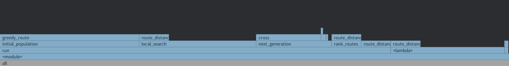

## 📌目录
- [📌目录](#目录)
- [人工智能实验报告 实验三 TSP问题](#人工智能实验报告-实验三-tsp问题)
  - [一.实验题目](#一实验题目)
  - [二.实验内容](#二实验内容)
    - [1. 算法原理](#1-算法原理)
    - [2. 关键代码展示](#2-关键代码展示)
      - [1. 代码结构](#1-代码结构)
      - [2. init 函数](#2-init-函数)
      - [3. calculate\_distances\_matrix 函数](#3-calculate_distances_matrix-函数)
      - [4. greedy\_route 函数](#4-greedy_route-函数)
      - [5. initial\_population 函数](#5-initial_population-函数)
      - [6. rank\_routes 函数](#6-rank_routes-函数)
      - [7. cross 函数](#7-cross-函数)
      - [8. mutate 函数](#8-mutate-函数)
      - [9. local\_search 函数](#9-local_search-函数)
      - [10. get\_dynamic\_mutation\_rate 函数](#10-get_dynamic_mutation_rate-函数)
      - [11. elite\_tournament\_selection 函数](#11-elite_tournament_selection-函数)
      - [12. next\_generation 函数](#12-next_generation-函数)
      - [13. run 函数](#13-run-函数)
    - [3. 创新点\&优化](#3-创新点优化)
      - [距离矩阵的提前计算](#距离矩阵的提前计算)
      - [使用路径缓存cache](#使用路径缓存cache)
      - [使用贪心算法生成初始种群](#使用贪心算法生成初始种群)
      - [2-opt 局部搜索优化](#2-opt-局部搜索优化)
      - [动态调整变异率](#动态调整变异率)
      - [精英锦标赛选择](#精英锦标赛选择)
  - [三.实验结果及分析](#三实验结果及分析)
    - [1.实验结果展示示例](#1实验结果展示示例)
      - [1. `dj38.tsp` 测试案例](#1-dj38tsp-测试案例)
      - [2. `lu980.tsp` 测试案例](#2-lu980tsp-测试案例)
      - [3. `mu1979.tsp` 测试案例](#3-mu1979tsp-测试案例)
    - [2.评测指标展示及分析](#2评测指标展示及分析)
      - [1. 比较有无初始化种群与局部优先化的结果](#1-比较有无初始化种群与局部优先化的结果)
      - [2. 分析火焰图](#2-分析火焰图)
  
---

## 人工智能实验报告 实验三 TSP问题

### 一.实验题目
- 本次实验基于 遗传算法 学习有：
  - 任务： `TSP` 问题
  - 编写程序，使用遗传算法求解 `TSP` 问题
### 二.实验内容
- `TSP` 问题是指：
  - 给定一组城市和它们之间的距离，要求找到一条最短路径，使得每个城市恰好访问一次，并返回到起始城市。
#### 1. 算法原理
- 算法仿照生物染色体遗传学原理，模拟自然选择和遗传变异的过程。包括过程：
  - 生成初始种群
  - 选择父母操作
  - 交叉操作
  - 变异操作
  - 生成新种群
#### 2. 关键代码展示
##### 1. 代码结构
- 代码结构如下：（主要展示类`GeneticAlgTSP`的实现）
    ```
    GeneticAlgTSP
    ├── __init__() - 初始化遗传算法参数
    ├── calculate_distances_matrix() - 计算城市间距离矩阵
    ├── read_tsp_file() - 读取TSP文件数据
    ├── greedy_route() - 使用贪心算法生成路径
    ├── initial_population() - 初始化种群
    ├── rank_routes() - 计算适应度并排序
    ├── route_distance() - 计算路径总距离
    ├── cross() - 交叉操作
    ├── mutate() - 变异操作
    ├── local_search() - 局部搜索优化
    ├── get_dynamic_mutation_rate() - 动态调整变异率
    ├── elite_tournament_selection() - 精英锦标赛选择
    ├── next_generation() - 生成下一代种群
    └── run() - 运行遗传算法主流程
    ```
##### 2. init 函数
- `__init__`函数主要用于初始化遗传算法的参数，包括种群大小、交叉概率、变异概率、迭代次数等。
  - 使用`numpy` 数组来存储`.tsp`文件中的城市坐标数据，行数代表城市数量，列数代表城市坐标。（两列：x,y 坐标）
  - 设置精英个体数量，在选择父母时保留最优个体。
  - 设置改进计数器，记录连续多少代没有改进。以便动态调整变异率。 
  - 添加路径缓存，如果之前有相同的路径计算过了，就直接返回缓存的值，避免重复计算。
```python
def __init__(self, file:str, pop_size=50, elite_size=8, mutation_rate=0.01, generations=100):
    self.cities = np.array([coord[1:] for coord in self.read_tsp_file(file)])
    self.population = [] # 种群
    self.pop_size = pop_size # 种群大小
    self.elite_size = elite_size # 精英个体数量
    self.mutation_rate = mutation_rate # 变异率
    self.generations = generations # 迭代次数
    self.best_routes = []
    self.best_distances = 0

    self.no_improvement_count = 0 # 无改进计数器

    self.distances_matrix = self.calculate_distances_matrix(self.cities) # 计算距离矩阵
    self.route_distance_cache = {}  # 添加路径距离缓存
```
##### 3. calculate_distances_matrix 函数
- 该函数对程序**运行时间优化较大**，预先计算城市间距离矩阵，在后续计算路径距离时可以直接读取距离矩阵，避免了重复计算。
  - 使用`numpy`中的`np.linalg.norm`计算两个城市之间的欧几里得距离：$\text{dist} = \sqrt{(x_2 - x_1)^2 + (y_2 - y_1)^2}$ 
  - 将计算出的距离填入矩阵的上三角部分
  - 由于距离矩阵是对称的，同时填充下三角部分
```python
def calculate_distances_matrix(self, coordinates):
    print("计算距离矩阵...")
    n = len(coordinates)
    distances = np.zeros((n, n))
    for i in range(n):
        for j in range(i + 1, n):
            dist = np.linalg.norm(coordinates[i] - coordinates[j])
            distances[i][j] = dist
            distances[j][i] = dist
    print("距离矩阵计算完成")
    return distances
```
##### 4. greedy_route 函数
> 凡事预则立，不预则废
- 此函数对程序的**结果优化较大**，初始的种群的质量优劣对后续的遗传算法能否得到较优结果影响很大。对初始种群使用贪心算法能在一开始就让种群每个元素的距离保持在较短水平。
  - 从一个起始城市开始，每次选择距离当前城市最近的未访问城市，直到访问完所有城市。
```py
def greedy_route(self, start_city):
    # 调整为从0开始的索引
    start_idx = start_city - 1
    
    route = [start_city]  # 城市编号从1开始
    unvisited = set(range(1, len(self.cities) + 1))
    unvisited.remove(start_city)
    
    current_idx = start_idx
    
    while unvisited:
        # 找到距离当前城市最近的未访问城市
        next_city = min(unvisited, 
                        key=lambda city: self.distances_matrix[current_idx][city-1])
        
        route.append(next_city)
        unvisited.remove(next_city)
        current_idx = next_city - 1
        
    return route
```
##### 5. initial_population 函数
> 千里之行，始于足下
- `initial_population` 函数调用 `greedy_route` 函数生成初始种群，使用贪心算法生成路径。
- 不过如果种群大小较大，贪心算法生成路径的时间复杂度会很高
```py
def initial_population(self):
    print("初始化种群...")
    population = []

    for _ in range(self.pop_size):
        start_city = random.randint(1, len(self.cities))
        route = self.greedy_route(start_city)
        population.append(route)
    
    self.population = population
    print("种群初始化完成")
    return population
```
##### 6. rank_routes 函数
- `rank_routes` 函数计算每个路径的适应度，并根据适应度对路径进行排序。返回排序后的路径索引。
```py
def rank_routes(self, routes):
    # 计算每条路径的距离
    fitness_results = {i: self.route_distance(route) for i, route in enumerate(routes)}
    
    # 返回按距离排序的索引
    return sorted(fitness_results.keys(), key=lambda x: fitness_results[x])
```

##### 7. cross 函数
- `cross` 函数实现交叉操作
  - 交叉采用部分映射交叉（PMX）方法，选择两个父母路径的部分进行交叉，然后更新未交叉部分的城市。
  - 最终生成两个孩子路径返回。
```py
def cross(self, p1, p2):
    # 随机选择交叉点
    start = random.randint(0, len(p1) - 1)
    end = random.randint(0, len(p1) - 1)
    if start > end:
        start, end = end, start

    # 创建交叉部分的映射关系
    p1_cross_section = p1[start:end]
    p2_cross_section = p2[start:end]
    
    # 创建映射字典
    mapping_p1_to_p2 = {}
    mapping_p2_to_p1 = {}
    
    # 为交叉部分的城市建立映射关系
    for i in range(start, end):
        mapping_p1_to_p2[p1[i]] = p2[i]
        mapping_p2_to_p1[p2[i]] = p1[i]
    
    # 初始化子代
    child1 = [-1] * len(p1)
    child2 = [-1] * len(p2)
    
    # 复制交叉部分
    for i in range(start, end):
        child1[i] = p2[i]
        child2[i] = p1[i]
    
    # 填充子代1的剩余部分
    for i in range(len(p1)):
        if i < start or i >= end:
            city = p1[i]
            while city in p2_cross_section:
                city = mapping_p2_to_p1[city]
            child1[i] = city
    
    # 填充子代2的剩余部分
    for i in range(len(p2)):
        if i < start or i >= end:
            city = p2[i]
            while city in p1_cross_section:
                city = mapping_p1_to_p2[city]
            child2[i] = city

    return child1, child2
```
##### 8. mutate 函数
- `mutate` 函数实现变异操作
  - 随机选择变异类型：反转、交换、插入、打乱。
  - 反转：`2-opt`变异，反转路径的一段。
  - 交换：随机交换两个城市。
  - 插入：将一个城市插入到另一个位置。
  - 打乱：随机打乱路径的一小段。
```py
def mutate(self, route):
    # 创建路径的副本，避免修改原始路径
    route_copy = route.copy()
    
    # 随机选择变异类型
    mutation_type = random.choice(["reverse", "swap", "insert", "scramble"])
    
    if mutation_type == "reverse":  # 2-opt变异，反转一段路径
        index1 = random.randint(0, len(route_copy) - 1)
        index2 = random.randint(0, len(route_copy) - 1)
        if index1 > index2:
            index1, index2 = index2, index1
        route_copy[index1:index2+1] = reversed(route_copy[index1:index2+1])
    
    elif mutation_type == "swap":  # 随机交换两个城市
        index1, index2 = random.sample(range(len(route_copy)), 2)
        route_copy[index1], route_copy[index2] = route_copy[index2], route_copy[index1]
    
    elif mutation_type == "insert":  # 将一个城市插入到另一个位置
        index1, index2 = random.sample(range(len(route_copy)), 2)
        city = route_copy.pop(index1)
        route_copy.insert(index2, city)
    
    elif mutation_type == "scramble":  # 随机打乱一小段路径
        index1 = random.randint(0, len(route_copy) - 1)
        index2 = random.randint(0, len(route_copy) - 1)
        if index1 > index2:
            index1, index2 = index2, index1
        segment = route_copy[index1:index2+1]
        random.shuffle(segment)
        route_copy[index1:index2+1] = segment
    
    return route_copy
```
##### 9. local_search 函数
- 局部搜索函数，使用`2-opt`算法进行局部搜索优化。能够进一步提高优秀个体路径质量
  - 随机选择路径中的一小部分进行`2-opt`交换，尝试找到更短的路径。
  - 设置最大迭代次数和最大时间限制，避免过长时间的计算。
  - 使用随机采样边进行检查，而不是检查所有边，减少计算量。
```py
def local_search(self, route, max_iterations=20, max_time=30):
    start_time = time.time()
    best_route = route.copy()
    best_distance = self.route_distance(best_route)
    iteration = 0
    
    while iteration < max_iterations:
        improved = False
        iteration += 1
        
        # 检查是否超时
        if time.time() - start_time > max_time:
            break
        
        # 随机采样边进行检查，而不是检查所有边
        edge_samples = min(500, len(route) // 2)  # 最多检查500条边
        edges_to_check = random.sample(range(1, len(route) - 2), edge_samples) # 排除首尾城市
        
        for i in edges_to_check:
            # 每次只检查一小部分j值
            j_range = min(50, len(route) - i)
            j_values = [i + j for j in range(2, j_range)]
            
            for j in j_values:
                # 尝试2-opt交换：反转i到j之间的路径
                new_route = best_route.copy()
                new_route[i:j+1] = reversed(new_route[i:j+1])
                new_distance = self.route_distance(new_route)
                
                # 如果有改进，更新最佳路径
                if new_distance < best_distance:
                    best_distance = new_distance
                    best_route = new_route
                    improved = True
                    break  
            
            if improved:
                break 
        
        # 如果没有改进，提前终止
        if not improved:
            break
    
    return best_route
```
##### 10. get_dynamic_mutation_rate 函数
- 动态调整变异率函数（这个函数在 `next_generation`函数中调用）
  - 根据不同情况调整变异率：
    - 如果连续多代没有改进，增加变异率。
    - 如果迭代次数较多，降低变异率。
    - 在迭代过程中线性衰减变异率，防止过早收敛。
```py
def get_dynamic_mutation_rate(self, generation):
    # 最大和最小变异率
    max_rate = self.mutation_rate * 2
    min_rate = self.mutation_rate / 2
    
    # 根据迭代次数和无改进次数调整
    if self.no_improvement_count > 5:  # 长时间无改进，提高变异率
        return max_rate
    elif generation > 70:  # 后期降低变异率
        return min_rate
    else:
        # 线性衰减
        return max_rate - (max_rate - min_rate) * (generation / 100)
```
##### 11. elite_tournament_selection 函数
- 精英锦标赛选择函数
  - 从种群中随机选择精英个体数量的个体，再加上锦标赛选择，最终返回两者合并后的最优个体。
```py
def elite_tournament_selection(self, current_gen):
    selected = []
    
    # 计算所有个体适应度并排序
    sorted_indices = self.rank_routes(current_gen)
    
    # 精英选择: 直接保留最优秀的elite_size个体
    elite_indices = sorted_indices[:self.elite_size]
    selected.extend([current_gen[i] for i in elite_indices])
    
    # 锦标赛选择: 填充剩余位置
    while len(selected) < self.pop_size:
        # 随机选择锦标赛参与者
        tournament_size = 5
        tournament = random.sample(range(len(current_gen)), tournament_size)
        
        # 找出锦标赛中最好的个体
        best_idx = min(tournament, key=lambda i: self.route_distance(current_gen[i]))
        selected.append(current_gen[best_idx])
    
    return selected
```
##### 12. next_generation 函数
- `next_generation` 函数主要用于生成下一代种群
  - 调用 `elite_tournament_selection` 函数选择父母
  - 随机选择两个父母进行交叉操作，生成两个孩子
  - 根据`get_dynamic_mutation_rate`获得的变异率，调用 `mutate` 函数进行变异操作
  - 将当前种群和新生成的后代合并
```py
def next_generation(self, current_gen):
    parents = self.elite_tournament_selection(current_gen)

    offspring = []
    
    # 生成指定数量的后代
    for _ in range(self.pop_size // 2):  
        # 随机选择两个父母进行交叉
        parent1, parent2 = random.sample(parents, 2)
        
        # 交叉操作
        child1, child2 = self.cross(parent1, parent2)
        
        # 变异操作
        current_mutation_rate = self.get_dynamic_mutation_rate(self.generations)
        if random.random() < current_mutation_rate:
            child1 = self.mutate(child1)
        if random.random() < current_mutation_rate:
            child2 = self.mutate(child2)
            
        # 添加到后代种群 
        offspring.extend([child1, child2])
    
    combined_population = current_gen + offspring
    
    # 适应度排序
    sorted_indices = self.rank_routes(combined_population)
    
    # 选择最优的个体
    next_gen = [combined_population[i] for i in sorted_indices[:self.pop_size]]
    
    return next_gen
```
##### 13. run 函数
- `run` 函数将上述所有函数串起来，主要的思路流程就是在 ↑ [算法原理](#1-算法原理) 中提到的几个流程
```py
def run(self):
    # 初始化种群
    self.initial_population()
    start_time = time.time()

    # 迭代进化
    for generation in range(self.generations):
        self.population = self.next_generation(self.population)
        
        # 记录当前最优路径和距离
        best_route = self.population[0]
        
        # 对最优个体进行局部搜索
        if generation % 5 == 0 :
            best_route = self.local_search(best_route)

        # 将优化后的路径替换回种群中的最佳个体
        sorted_indices = self.rank_routes(self.population)
        best_idx = sorted_indices[0]
        self.population[best_idx] = best_route.copy()
        
        best_distance = self.route_distance(best_route)

        if self.best_distances >= best_distance:
            self.no_improvement_count += 1

        self.best_routes.append(best_route)
        self.best_distances = best_distance
        
        print(f"Generation {generation}: Best Distance = {best_distance}")
    
    end_time = time.time()
    print(f"运行时间: {end_time - start_time:.2f}秒")
    # 返回最优路径和距离
    return self.best_routes[-1], self.best_distances
```
#### 3. 创新点&优化
##### 距离矩阵的提前计算
- 用`numpy`数组存储城市坐标数据，使得在计算城市间距离的时候比列表快得多
- 但是由于每个路径的距离都要计算，所以还是会比较慢
- 于是在开始遗传算法前，先计算好城市间的距离矩阵，这样后续在计算路径距离的时候就可以直接读取距离矩阵，避免了重复计算
##### 使用路径缓存cache
- 虽然已有距离矩阵，也只是在城市之间计算距离
- 如果有一些路径已经计算过距离，就可以直接返回缓存的值，能进一步加快计算速度
##### 使用贪心算法生成初始种群
- 贪心算法：在每一步中，它都选择当前看起来最优的选择（即筛选离自己最近的城市加入路径），希望通过一系列局部最优选择最终得到全局最优解。
- 初始种群的优劣影响很大，见 ↓ [评测指标展示及分析](#2评测指标展示及分析) 的对比
##### 2-opt 局部搜索优化
- 如果能在最优个体上进一步优化，那就能更快得到更好的结果
- 在实践中发现：
  - 局部搜索往往是减少路径长度的转折点，配合遗传交配和变异，路径能持续优化，减少出现迭代好几代都没有改进的情况
  - 但是局部搜索的时间复杂度较高，可能会导致算法运行时间过长，所以需要设置频率和时间限制（不过，在我实践中发现，少次数迭代而高频的局部搜索，比较高次数迭代而低频的局部搜索效果更好）
- 有无局部搜索的对比见 ↓ [评测指标展示及分析](#2评测指标展示及分析) 的对比
##### 动态调整变异率
- 变异率过高，容易导致种群多样性过大，收敛速度慢；变异率过低，容易导致种群多样性不足，陷入局部最优解。
- 动态调整变异率可以根据当前种群的适应度和迭代次数来调整变异率，避免过早收敛。
- 具体调整方式见 ↑ [11. get_dynamic_mutation_rate 函数](#11-get_dynamic_mutation_rate-函数)
##### 精英锦标赛选择
- 在现实生活中，“近亲结婚”总是容易产生先天性基因不良的个体
- 在模仿遗传算法中，为了避免这种情况，除了选择精英个体，为了增加多样性，锦标赛选择也很重要
- 通过 “一部分精英+一部分锦标赛个体” 来选择父母，能更好地保持种群的多样性
### 三.实验结果及分析
- 程序可以调整的变量有：
    - `pop_size`：种群大小
    - `elite_size`：精英个体数量
    - `mutation_rate`：变异率
    - `generations`：迭代次数
      - 根据迭代次数同步设置`get_dynamic_mutation_rate`函数中何时收敛
    - 局部搜索的频率
    - `max_iterations`：局部搜索最大迭代次数
    - `max_time`：局部搜索最大时间限制
    - `tournament_size`：锦标赛选择的参与者数量
    - `edge_samples`：局部搜索中随机采样的边数量
- 共有三个测试案例，分别是：
  - `dj38.tsp`： $38$ 个城市
  - `lu980.tsp`： $980$ 个城市
  - `mu1979.tsp`： $1979$ 个城市
- **实验结果**将展示在不同的参数设置下，程序运行的时间和最终路径长度
- 而**评测指标**将对比有无初始种群、有无局部搜索对结果的影响
#### 1.实验结果展示示例
##### 1. `dj38.tsp` 测试案例

| 实验编号 | 种群大小 (pop_size) | 精英数量 (elite_size) | 变异率 (mutation_rate) | 迭代次数 (generations) | 局部搜索频率 |
| :------: | :-----------------: | :-------------------: | :--------------------: | :--------------------: | :----------: |
|    1     |         50          |           5           |          0.01          |          100           |      5       |
|    2     |         100         |          10           |          0.02          |          200           |      10      |
|    3     |         200         |          20           |          0.05          |          300           |      12      |

- 实验1：
  - 运行时间：`0.19秒`
  - 最优路径长度：`6664.11`
  - 收敛过程
  - 路径可视化
- 实验2：
  - 运行时间：`0.54秒`
  - 最优路径长度：`6659.43`
  - 收敛过程
  - 路径可视化
- 实验3：
  - 运行时间：`1.49秒`
  - 最优路径长度：`6659.43`
  - 收敛过程
  - 路径可视化
##### 2. `lu980.tsp` 测试案例
| 实验编号 | 种群大小 (pop_size) | 精英数量 (elite_size) | 变异率 (mutation_rate) | 迭代次数 (generations) | 局部搜索频率 |
| :------: | :-----------------: | :-------------------: | :--------------------: | :--------------------: | :----------: |
|    1     |         50          |           8           |          0.01          |           60           |      2       |
|    2     |         500         |          20           |          0.02          |          100           |      5       |
|    3     |        1000         |          35           |          0.03          |          100           |      5       |
- 实验1：
  - 运行时间：`219.11秒`
  - 最优路径长度：`12756.88`
  - 收敛过程
  - 路径可视化
- 实验2：
  - 运行时间：`91.06秒`（笔记本插电了，CPU 升频）
  - 最优路径长度：`12707.73`
  - 收敛过程
  - 路径可视化  
- 实验3
  - 运行时间：`200.92秒`（笔记本插电了，CPU 升频）
  - 最优路径长度：`12621.74`
  - 收敛过程
  - 路径可视化  
##### 3. `mu1979.tsp` 测试案例
| 实验编号 | 种群大小 (pop_size) | 精英数量 (elite_size) | 变异率 (mutation_rate) | 迭代次数 (generations) | 局部搜索频率 |
| :------: | :-----------------: | :-------------------: | :--------------------: | :--------------------: | :----------: |
|    1     |         500         |          10           |          0.02          |           60           |      2       |
|    2     |        1000         |          35           |          0.02          |           60           |      2       |
|    3     |        2000         |          55           |          0.03          |          100           |      4       |
- 实验1：
  - 运行时间：`618.97秒`
  - 最优路径长度：`105794.73`
  - 收敛过程
  - 路径可视化
- 实验2：
  - 运行时间：`618.97秒`（初始化种群的时间没有计算进去，但是大种群初始化时间会很长）
  - 最优路径长度：`105350.97`
  - 收敛过程
  - 路径可视化
- 实验3：
  - 运行时间：`803.82秒`（初始化种群的时间没有计算进去，但是大种群初始化时间会很长）
  - 最优路径长度：`105264.93秒`
  - 收敛过程
  - 路径可视化
- 由于数据量较大，在前期测试中发现少量迭代，多次局部搜索更加有效
#### 2.评测指标展示及分析
##### 1. 比较有无初始化种群与局部优先化的结果
- 由于`lu980.tsp`和`mu1979.tsp`数据量较大，运行时间较长，所以只展示`dj38.tsp`的对比结果
- 变量取 [实验结果展示示例](#1实验结果展示示例) 中的实验编号2
    |     -/-      | 贪心算法 + 局部搜索 | 不使用贪心算法 + 不适用局部搜索 |
    | :----------: | :--------: | :-----------------------------: |
    |   运行时间   |   0.54秒   |             0.27秒              |
    | 最优路径长度 |  6664.11   |             8790.10             |
##### 2. 分析火焰图
- 
- 从图中可以看出，路径计算多次被调用，所以优化路径计算函数（引入距离矩阵是必要的）
- `greedy_route`函数的调用次数也很高，贪心算法在大种群中占用时间很大（但是实验主要是“遗传算法”，所以我没有将这一部分时间算进去）
---
> 数据集来自：[LINK](https://www.math.uwaterloo.ca/tsp/world/countries.html)