## 📌目录
- [📌目录](#目录)
- [人工智能实验报告 实验四 多层感知机](#人工智能实验报告-实验四-多层感知机)
  - [一.实验题目](#一实验题目)
  - [二.实验内容](#二实验内容)
    - [1. 算法原理](#1-算法原理)
      - [（1）多层感知机（MLP）](#1多层感知机mlp)
      - [（2）涉及到的一些函数](#2涉及到的一些函数)
    - [2. 关键代码展示](#2-关键代码展示)
      - [代码结构](#代码结构)
      - [关键函数](#关键函数)
    - [3. 创新点\&优化](#3-创新点优化)
  - [三.实验结果及分析](#三实验结果及分析)
    - [1. 对比不同感知机层数，学习率的结果（使用`mini-batch`训练）](#1-对比不同感知机层数学习率的结果使用mini-batch训练)
      - [实验编号 1](#实验编号-1)
      - [实验编号 2](#实验编号-2)
      - [实验编号 3](#实验编号-3)
      - [实验编号 4](#实验编号-4)
      - [对比总结](#对比总结)
      - [附：](#附)
    - [2. 对比`mini-batch`和全量训练的结果](#2-对比mini-batch和全量训练的结果)
      - [实验编号 1](#实验编号-1-1)
        - [不使用`mini-batch`训练](#不使用mini-batch训练)
      - [实验编号 3](#实验编号-3-1)
        - [不使用`mini-batch`训练](#不使用mini-batch训练-1)
      - [总结](#总结)
  - [四.参考资料](#四参考资料)

---

## 人工智能实验报告 实验四 多层感知机
### 一.实验题目
- 编写多层感知机（MLP）程序，实现房价预测
- 绘制数据可视化图、loss 曲线图
### 二.实验内容
#### 1. 算法原理
##### （1）多层感知机（MLP）
- 多层感知机（MLP）是一个前馈神经网络，由输入层、隐藏层和输出层组成。
- 每一层的神经元与下一层的神经元之间都有连接。设置**权重和偏置**来调整每个神经元的输出，然后通过**激活函数**进行非线性变换。
- MLP 的训练过程使用**前向传播 + 反向传播**算法
  - **前向传播**：输入数据通过网络层层传递，计算出输出结果。
  - **反向传播**：根据输出结果和真实标签计算损失函数，然后通过链式法则计算每个参数的梯度，更新参数。【梯度下降的公式为： $W = W - \eta \frac{\partial L}{\partial W}$ 其中 $\eta$ 为学习率】
- 通过不断迭代更新参数，最小化损失函数，从而使模型更好地拟合训练数据。
##### （2）涉及到的一些函数
- 假定网络为多层感知机，网络输出为 $\hat{y} = \text{MLP}(X_{\text{train}})$，其中 $X$ 为房子的特征， $\text{MLP}$ 为多层神经网络， $W$ 和 $b$ 为 $\text{MLP}$ 的参数， $\hat{y}$ 为预测的房价。
- 激活函数选择为 $ReLU$ ，激活函数为：
```math
\text{ReLU}(x) = \max(0, x)
```
  - 其导数为：
```math
\text{ReLU}'(x) = \begin{cases}
1 & \text{if } x > 0 \\
0 & \text{if } x \leq 0
\end{cases}
```
- 设置损失函数为 $L_{\text{MSE}}$
```math
L_{\text{MSE}} = \frac{1}{m} \sum_{i=1}^{m} (y_i - \hat{y}_i)^2
```
-  $He$ 方法初始化参数为：
    - 其中 $n_{\text{in}}$ 为输入层的神经元个数
    - $W$ 服从一个均值为 $0$，方差为 $\frac{2}{n_{\text{in}}}$ 的正态分布，可以保证值在网络中不会被放大或缩小太快。
    - $b$ 一开始**一般设置为 $0$**，在训练中， $b$ 的值可以很快训练出来，如果设置像 $W$ 的高斯分布，相当于人为加了“随机偏移”，这些偏移早期反而可能干扰梯度方向。
```math
W \sim \mathcal{N}(0, \frac{2}{n_{\text{in}}})
``` 
- 神经元的输出为：
```math
z = W \cdot X + b\\
\hat{y} = \text{ReLU}(W \cdot X + b)
```
- 所以损失函数对 $W$ 的导数为：
 ```math 
 \frac{\partial L}{\partial W} = \frac{\partial L}{\partial z} \cdot \frac{\partial z}{\partial W}
 ```
- 梯度下降法公式：
    ```math
    W = W - \eta \cdot \frac{\partial L}{\partial W}
    ```
#### 2. 关键代码展示
##### 代码结构
```bash
houses_price_pred.py
├── relu(x) - ReLU激活函数
├── relu_derivative(x) - ReLU激活函数的导数
├── load_data(filename) - 从CSV文件中加载数据
├── standardScaler(InputData) - 标准化特征矩阵
├── inverseStandardScaler(InputData, mean, std) - 反标准化特征矩阵
├── trainTestSplit(X, Y, test_size=0.2, random_state=None) - 划分训练集和测试集
├── create_mini_batches(X, Y, batch_size) - mini-batches创建小批量数据
├── MLP
│   ├── __init__(self, layers, activation, learning_rate, max_iterations) - 初始化多层感知机
│   ├── _initialize_parameters(self) - 初始化权重和偏置
│   ├── forward(self, X) - 前向传播
│   ├── backward(self, X, Y, cache) - 反向传播
│   ├── update(self, gradients) - 更新权重和偏置
│   ├── compute_loss(self, Y, Y_pred) - 计算均方误差损失
│   └── run(self, X, Y) - 训练模型
├── main() - 主函数
└── if __name__ == "__main__": - 程序入口
```
##### 关键函数
- 标准化与反标准化函数（`standardScaler` 和 `inverseStandardScaler`）
    ```py
    # 矩阵标准化
    def standardScaler(InputData):
        """
        标准化特征矩阵
        :param InputData: 特征矩阵
        :return: 均值，标准差，标准化后的特征矩阵
        """
        mean = np.mean(InputData, axis=0)  # 均值
        std = np.std(InputData, axis=0)  # 标准差
        return (mean, std, (InputData - mean) / std)

    # 反标准化
    def inverseStandardScaler(InputData, mean, std):
        """
        反标准化特征矩阵
        :param InputData: 特征矩阵
        :param mean: 均值
        :param std: 标准差
        :return: 反标准化后的特征矩阵
        """
        return InputData * std + mean
    ```
  - 标准化是将数据转换为均值为 $0$ ，方差为 $1$ 的分布，使得数据在同一尺度上进行比较。
    - 标准化可以避免特征值范围差异对模型训练的影响，保证梯度更新稳定性
  - 反标准化是将标准化后的数据转换回原始数据的尺度。
  - 使用`numpy`库中的`mean`和`std`函数计算均值和标准差，使用`axis=0`参数表示按列计算。（传入矩阵列表示特征，行表示样本）
- 划分训练集和测试集函数（`trainTestSplit`）
    ```py
    def trainTestSplit(X, Y, test_size=0.2, random_state=None):
        """
        划分训练集和测试集
        :param X: 特征矩阵
        :param Y: 目标变量
        :param test_size: 测试集比例
        :param random_state: 随机种子
        :return: X_train, X_test, Y_train, Y_test
        """
        if random_state is not None:
            np.random.seed(random_state)
        
        # 获取样本数量
        n_samples = X.shape[0]
        
        # 计算测试集样本数
        n_test = int(n_samples * test_size)
        
        # 生成随机索引
        indices = np.random.permutation(n_samples)
        test_indices = indices[:n_test]
        train_indices = indices[n_test:]
        
        # 划分数据集
        X_train, X_test = X[train_indices], X[test_indices]
        Y_train, Y_test = Y[train_indices], Y[test_indices]
        
        return X_train, X_test, Y_train, Y_test
    ```
  - 划分数据集有利于评估模型的泛化能力，避免过拟合。
  - 使用`numpy`库中的`random.permutation`函数生成随机索引，使用切片划分训练集和测试集。
- `create_mini_batches`函数
    ```py
    # mini-batch函数
    def create_mini_batches(X, Y, batch_size):
        """
        mini-batch
        :param X: 特征矩阵
        :param Y: 目标变量
        :param batch_size: batch大小
        :return: mini-batch列表，每个元素为(X_batch, Y_batch)
        """
        mini_batches = []
        n_samples = X.shape[0]
        
        # 洗牌
        indices = np.random.permutation(n_samples)
        X_shuffled = X[indices]
        Y_shuffled = Y[indices]
        
        # 创建mini-batches
        num_complete_batches = n_samples // batch_size
        for i in range(num_complete_batches):
            X_batch = X_shuffled[i * batch_size:(i + 1) * batch_size]
            Y_batch = Y_shuffled[i * batch_size:(i + 1) * batch_size]
            mini_batches.append((X_batch, Y_batch))
        
        # 处理剩余样本
        if n_samples % batch_size != 0:
            X_batch = X_shuffled[num_complete_batches * batch_size:]
            Y_batch = Y_shuffled[num_complete_batches * batch_size:]
            mini_batches.append((X_batch, Y_batch))
        
        return mini_batches
    ```
    - `create_mini_batches`函数用于创建小批量数据，而不是所有数据一起训练
    - `batch_size`是每个小批量的大小，`mini_batches`是一个列表，每个元素是一个元组，包含一个小批量的特征矩阵和目标变量
    - 先随机打乱数据使得更加接近真实数据分布，然后划分成小批量
- 初始化权重和偏置函数（`_initialize_parameters`）
    ```py
    def _initialize_parameters(self):
        """
        初始化权重和偏置
        He初始
        """
        for i in range(1, len(self.layers)):
            # 权重矩阵初始化为随机值，偏置初始化为零
            self.weights[i] = np.random.randn(self.layers[i], self.layers[i-1]) * np.sqrt(2 / self.layers[i-1])
            self.biases[i] = np.zeros((self.layers[i], 1))
    ```
    - `np.random.randn(a, b)`生成一个 shape 为 (a, b) 的数组，里面是标准正态分布（均值为 $0$ ，方差为 $1$ ）随机数。
    - `np.sqrt(2 / self.layers[i-1])`把这些数放缩，使得它们变成方差为 $\frac{2}{n_{\text{in}}}$ 的正态分布
    - `np.zeros((self.layers[i], 1))`生成一个 shape 为 (a, 1) 的数组，里面是 $0$ ，表示偏置初始化为 $0$。
- 前向传播函数（`forward`）
    ```py
    def forward(self, X):
        """
        前向传播
        :param X: 输入数据
        :return: 输出out和缓存cache
        """
        cache = {}  # 缓存字典，记录每层的权和和激活值
        out = X.T # X原来是[8000:4]，转置后是[4:8000]

        for i in range(1, len(self.layers)):
            net = np.dot(self.weights[i], out) + self.biases[i]
            cache['net' + str(i)] = net  # 记录每层的权和

            # 排除输出层
            if i == len(self.layers) - 1:
                out = net
            else:
                out = self.activation(net)
            cache['out' + str(i)] = out

        return out, cache # 返回的out：[1:8000]
    ```
    - 这里需要注意的点是：在前向传播中利用`cache`字典记录每层的权和和激活值，后续反向传播就不用二次计算
    - 使用`np.dot`函数计算矩阵乘法，计算出的矩阵行为当前层的神经元个数，列为训练样本数
    - 输出层不使用激活函数，直接输出线性值
- 反向传播函数（`backward`）
    ```py
    def backward(self, X, Y, cache):
        """
        反向传播
        :param X: 输入数据
        :param Y: 目标值
        :param cache: 前向传播的缓存
        :return: 梯度
        """
        results = {}
        L = len(self.layers)
        m = X.shape[0] # 样本数量
        
        # 输出层梯度
        dout = (cache['out' + str(L-1)] - Y.T) * (2/m)
        dW = np.dot(dout, cache['out' + str(L-2)].T) if L > 2 else 1/m * np.dot(dout, X)
        db = np.sum(dout, axis=1, keepdims=True)
        
        results[L - 1] = (dW, db) # 权重和偏置的梯度
        
        # 隐藏层梯度
        for i in reversed(range(1, L-1)):
            dout = np.dot(self.weights[i+1].T, dout)  * self.activation_derivative(cache['net' + str(i)])
            out_prev = cache['out' + str(i-1)] if i > 1 else X.T
            dW = np.dot(dout, out_prev.T)
            db = np.sum(dout, axis=1, keepdims=True)
            
            results[i] = (dW, db)
            
        return results
    ```
- 再来看对 $W$ 求导的反向传播公式：
      
```math 
\frac{\partial L}{\partial W} = \frac{\partial L}{\partial z} \cdot \frac{\partial z}{\partial W}
``` 

- 那么在矩阵运算中，可以写成：(这里的 $X$ 代表的是前一层的输出， $z$ 是当前层的线性组合（加权和与偏置）)
    
$$
\frac{\partial L}{\partial W} = \frac{\partial L}{\partial \hat{y}} \cdot \frac{\partial \hat{y}}{\partial z} \cdot \frac{\partial z}{\partial W}\\
\space \\
= \frac{\partial L}{\partial \hat{y}} \cdot \text{ReLU}'(z) \cdot X
$$

- 对 $b$ 的求导公式为：

$$
\frac{\partial L}{\partial b} = \frac{\partial L}{\partial \hat{y}} \cdot \frac{\partial \hat{y}}{\partial z} \cdot \frac{\partial z}{\partial b}\\
\space \\
= \frac{\partial L}{\partial \hat{y}} \cdot \text{ReLU}'(z) \cdot 1
$$

- 在代码实际计算中，输出层里的 $dW$ 计算方式和隐藏层不一样：
  - 输出层由于线性输出，所以只要计算损失函数的导数 $\frac{\partial L}{\partial z}$ ，即  `dout = (cache['out' + str(L-1)] - Y.T) * (2/m)` 
  - 隐藏层需要计算激活函数的导数，所以要乘上 `self.activation_derivative(cache['net' + str(i)])`，即 `dout = np.dot(self.weights[i+1].T, dout)  * self.activation_derivative(cache['net' + str(i)])`
    - 这里括号里面的 `dout` 是右边一层的`out`求导值，计算出来的`dout`是当前层的`out`求导值
    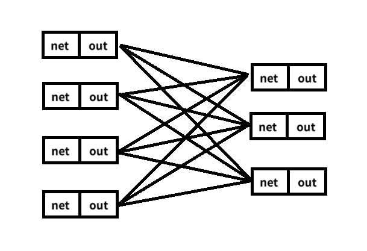
- 至于 $db$ 为什么是 `np.sum(dout, axis=1, keepdims=True)`，`dout` 的列是样本数，行是神经元个数，`np.sum(dout, axis=1, keepdims=True)` 就是对每一行求和，得到每个神经元的偏置梯度，因为每一个样本都会对每一个神经元的偏置产生影响
- `main` 函数
    ```py
    def main():
        X,Y = load_data("MLP_data.csv")

        # 数据标准化
        _,_,std_X_matrix = standardScaler(X)
        mean,std_Y,std_Y_matrix = standardScaler(Y)

        # 划分训练集和测试集
        X_train, X_test, Y_train, Y_test = trainTestSplit(std_X_matrix, std_Y_matrix, test_size=0.2, random_state=42)

        # 创建MLP模型
        mlp = MLP(layers=[X.shape[1], 32, 16, 8, 1], activation='relu', learning_rate=0.025, max_iterations=1000)
        mlp.run(X_train, Y_train)

        # 预测和反标准化（将测试集数据输入）
        Y_pred, _ = mlp.forward(X_test)
        Y_pred = inverseStandardScaler(Y_pred.T, mean, std_Y)  # 反标准化，注意转置
        
        Y_original = inverseStandardScaler(Y_test, mean, std_Y)  # 反标准化

        # 计算均方误差
        mse = np.mean((Y_pred - Y_original) ** 2)
        print(f"测试集MSE: {mse}")

        # ...（可视化部分省略）
    ```
    - 按照流程将各个函数串起来即可：
      - 加载数据
      - 标准化数据
      - 划分训练集和测试集
      - 创建模型
      - 训练模型
      - 预测
      - 反标准化
      - 计算均方误差
- 可视化部分
  - 绘制 loss 曲线以及预测结果与真实值的对比图
    ```py
    # 绘制损失曲线
    plt.figure(figsize=(10, 6))
    plt.plot(range(len(mlp.losses)), mlp.losses, label='Loss Curve')
    plt.xlabel('Iteration')
    plt.ylabel('Loss')
    plt.title('Training Loss Curve')
    plt.legend()
    plt.grid(True)
    plt.savefig('loss_curve.svg')
    plt.show()

    # 绘制预测值与真实值的散点图
    plt.figure(figsize=(10, 6))
    plt.scatter(Y_original, Y_pred, alpha=0.5)
    plt.plot([Y_original.min(), Y_original.max()], 
                [Y_original.min(), Y_original.max()], 
                'r--', lw=2)
    plt.xlabel('Actual Price')
    plt.ylabel('Predicted Price')
    plt.title('Actual vs Predicted House Prices')
    plt.savefig('prediction_results.svg')
    plt.grid(True)
    plt.show()
    ```
  - 使用 `pca` 进行降维（4 to 2）
      ```py
      from sklearn.decomposition import PCA
      # 使用PCA将特征从4维降至2维
      pca = PCA(n_components=2)
      X_test_original = inverseStandardScaler(X_test, *standardScaler(X)[:2])
      X_pca = pca.fit_transform(X_test_original)
      ```
  - 绘制降维后的 3D 散点图
    - 以降维后的特征作为 x,y 轴，真实房价作为 z 轴
    ```py
    # 3D散点图：降维特征作为x,y轴，真实房价作为z轴
    fig = plt.figure(figsize=(12, 10))
    ax1 = fig.add_subplot(111, projection='3d')
    scatter = ax1.scatter(X_pca[:, 0], X_pca[:, 1], Y_original.flatten(), 
                         c=Y_original.flatten(), cmap='viridis', s=50, alpha=0.6)
    ax1.set_xlabel('PCA Feature 1')
    ax1.set_ylabel('PCA Feature 2')
    ax1.set_zlabel('Actual House Price')
    ax1.set_title('3D Scatter Plot of Actual House Prices')
    plt.colorbar(scatter, ax=ax1, label='House Price')
    plt.show()
    ```
  - 绘制降维后的 3D 曲面图
    ```py
    # 3D曲面图：降维特征作为x,y轴，预测房价作为z轴
    fig = plt.figure(figsize=(12, 10))
    ax2 = fig.add_subplot(111, projection='3d')

    # 创建网格以便绘制平滑曲面
    xi = np.linspace(min(X_pca[:, 0]), max(X_pca[:, 0]), 100)
    yi = np.linspace(min(X_pca[:, 1]), max(X_pca[:, 1]), 100)
    X1, Y1 = np.meshgrid(xi, yi)

    # 插值得到平滑的z值
    Z = griddata((X_pca[:, 0], X_pca[:, 1]), Y_pred.flatten(), 
                (X1, Y1), method='cubic', fill_value=Y_pred.mean())

    # 绘制曲面
    surf = ax2.plot_surface(X1, Y1, Z, cmap=cm.coolwarm, linewidth=0, antialiased=True, alpha=0.8)

    # 添加原始散点
    ax2.scatter(X_pca[:, 0], X_pca[:, 1], Y_pred.flatten(), c='black', s=10, alpha=0.5)

    ax2.set_xlabel('PCA Feature 1')
    ax2.set_ylabel('PCA Feature 2')
    ax2.set_zlabel('Predicted House Price')
    ax2.set_title('3D Surface Plot of Predicted House Prices')
    plt.colorbar(surf, ax=ax2, label='Predicted House Price')
    plt.show()
    ```
    - `griddata`函数用于插值，创建一个网格以便绘制平滑曲面
    - `plot_surface`函数用于绘制曲面图，`scatter`函数用于绘制散点图
  - 查看原始特征的贡献
    - 由于从 4 维降到 2 维，绘制降维后的特征贡献图有利于分析原始特征对预测结果的影响
    ```py
    # 查看原始特征对主成分的贡献
    components = pd.DataFrame(
        pca.components_,
        columns=['经度', '纬度', '房龄', '房主收入']
    )
    plt.figure(figsize=(10, 6))
    plt.imshow(components, cmap='coolwarm')
    plt.xticks(range(4), ['经度', '纬度', '房龄', '房主收入'])
    plt.yticks(range(2), ['PC1', 'PC2'])
    plt.colorbar()
    plt.title('PCA 组成热力图')
    plt.show()
    ```
#### 3. 创新点&优化
- 采用矩阵运算加速计算
  - 使用`numpy`库进行矩阵运算，避免了循环，提高了计算效率
- 划分训练集和测试集
  - 划分训练集和测试集，可以评估模型的泛化能力，避免过拟合
- 对初始数据进行标准化
  - 标准化数据可以避免特征值范围差异对模型训练的影响，保证梯度更新稳定性
- 对初始权重和偏置采用`He`初始化
  - `He`初始化可以避免梯度消失或爆炸的问题，使得模型更容易收敛
- 使用`mini-batch`训练
  - `mini-batch`训练效果显著，相比于全量训练，loss 数值更小，结果更优秀【对比见 ↓[三.实验结果及分析](#三实验结果及分析)】
### 三.实验结果及分析
> - 1. 对比不同感知机层数，学习率的结果【迭代次数默认为 2000】
> - 2. 对比`mini-batch`和全量训练的结果
> - 其他默认参数：
>   - 激活函数：`ReLU`
>   - 损失函数：`MSE`
>   - 训练集比例：`0.8`
>   - 批量大小：`64`
#### 1. 对比不同感知机层数，学习率的结果（使用`mini-batch`训练）
|  -/-  |        感知机层数设置        | 学习率 | 最终 loss  |
| :---: | :--------------------------: | :----: | :---: |
|   **1**   | `[X.shape[1], 32, 16, 8, 1]` | 0.025  | 0.16043499676456366 |
|   **2**   | `[X.shape[1], 32, 16, 8, 1]` |  0.01  | 0.17424171263326405 |
|   **3**   |  `[X.shape[1], 64, 32, 1]`   | 0.025  | 0.15377667997212527 |
|   **4**   |  `[X.shape[1], 64, 32, 1]`   | 0.01  | 0.18376833214706986 |
##### 实验编号 1
- loss 曲线图
  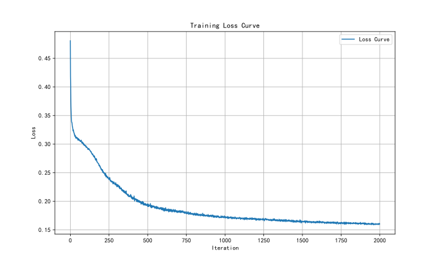
- 实际值与预测值对比图
  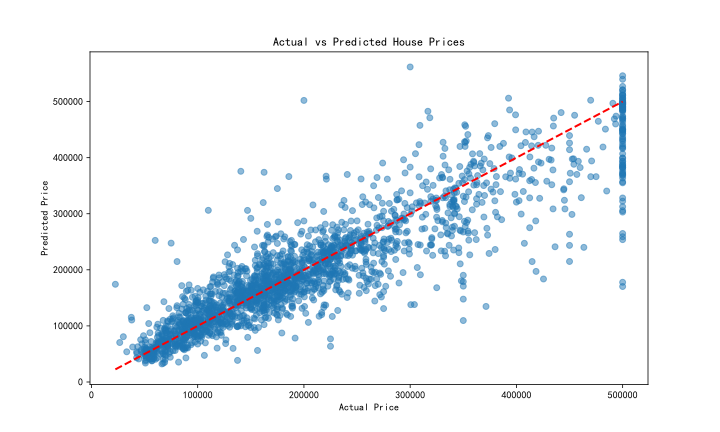
- 3D 实际值的散点图【html文件，点击查看】
    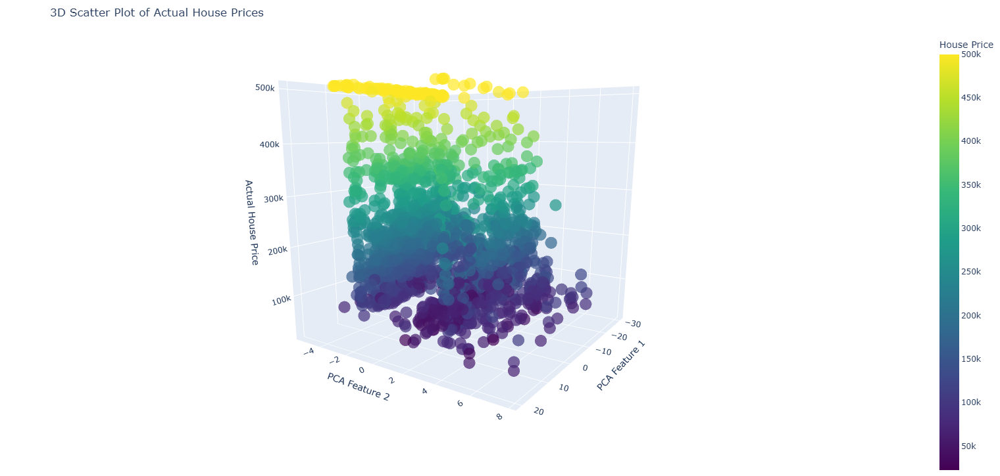
  - [3D_scatter_actual_price](./images/3D_scatter_actual_price1_1.html)
- 3D 曲面图 【html文件，点击查看】
  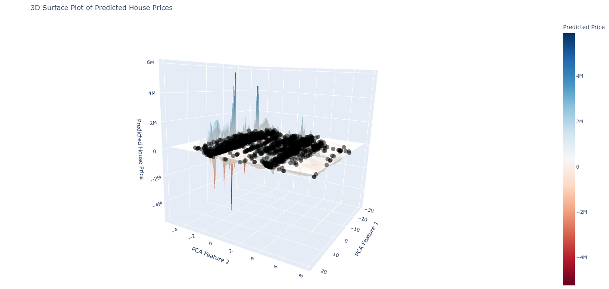
  - [3D_surface_predicted_price](./images/3D_surface_predicted_price1_1.html)
##### 实验编号 2
- loss 曲线图
  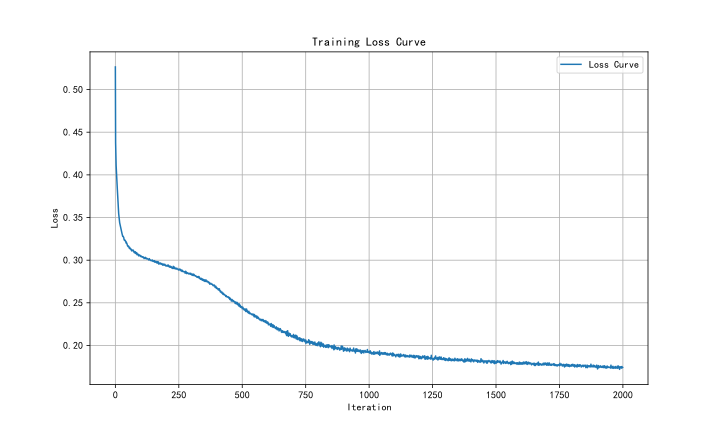
- 实际值与预测值对比图
  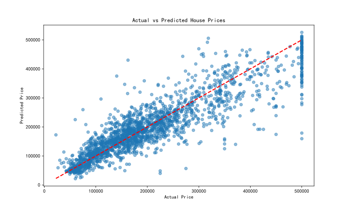
- 3D 实际值的散点图【html文件，点击查看】
    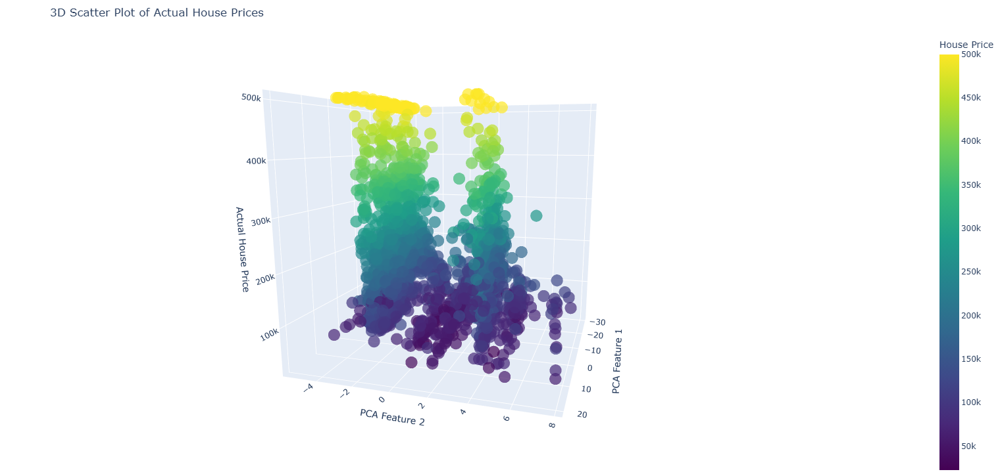
  - [3D_scatter_actual_price](./images/3D_scatter_actual_price1_2.html)
- 3D 曲面图 【html文件，点击查看】
    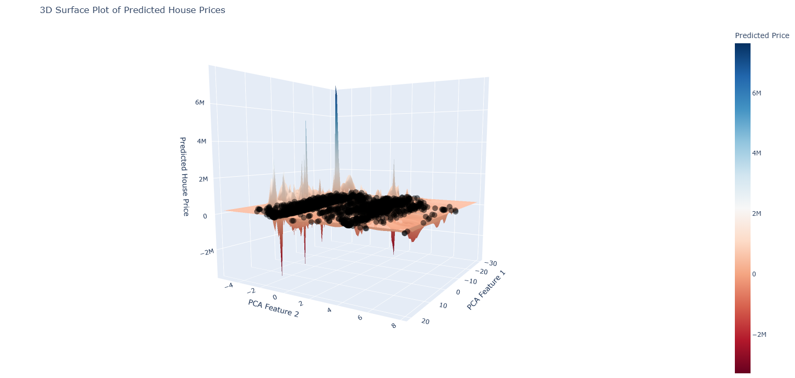
  - [3D_surface_predicted_price](./images/3D_surface_predicted_price1_2.html)
##### 实验编号 3
- loss 曲线图
  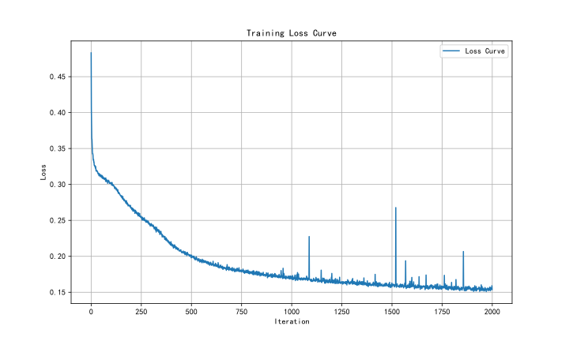
- 实际值与预测值对比图
    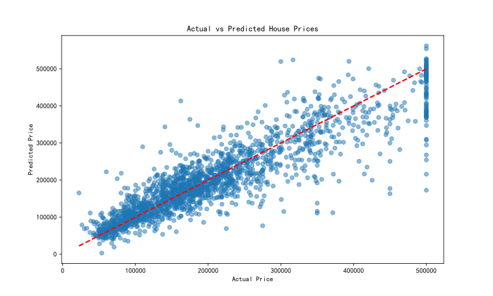
- 3D 实际值的散点图【html文件，点击查看】
    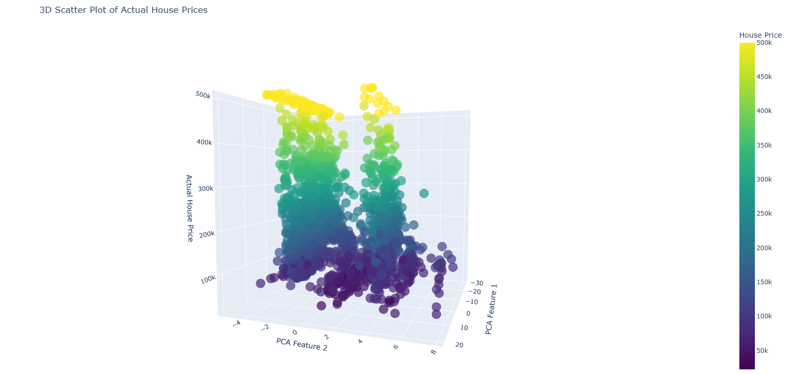
  - [3D_scatter_actual_price](./images/3D_scatter_actual_price1_3.html)
- 3D 曲面图 【html文件，点击查看】
    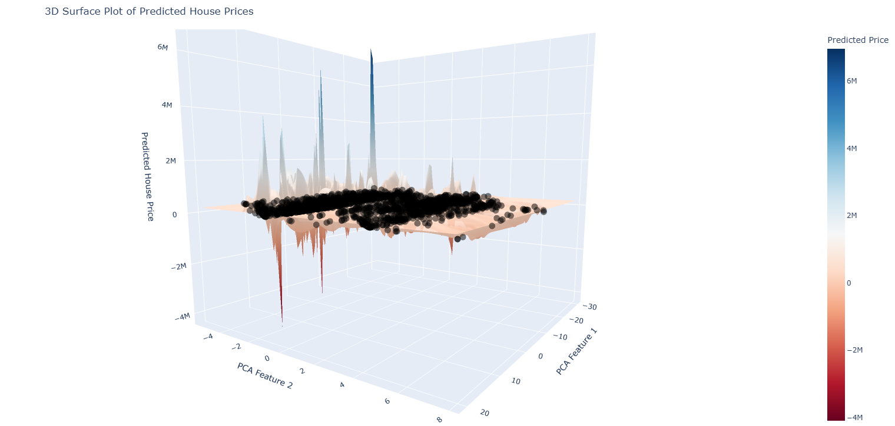
  - [3D_surface_predicted_price](./images/3D_surface_predicted_price1_3.html)
##### 实验编号 4
- loss 曲线图
  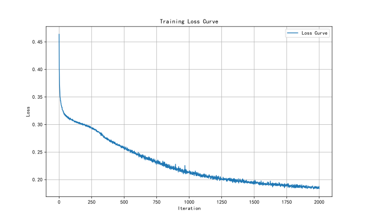
- 实际值与预测值对比图
  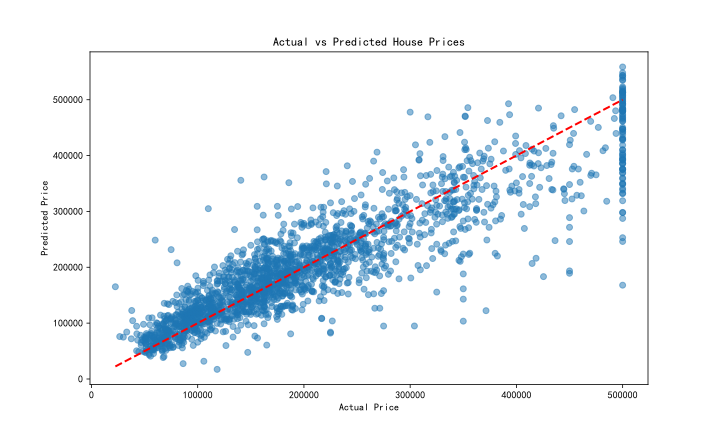
- 3D 实际值的散点图【html文件，点击查看】
    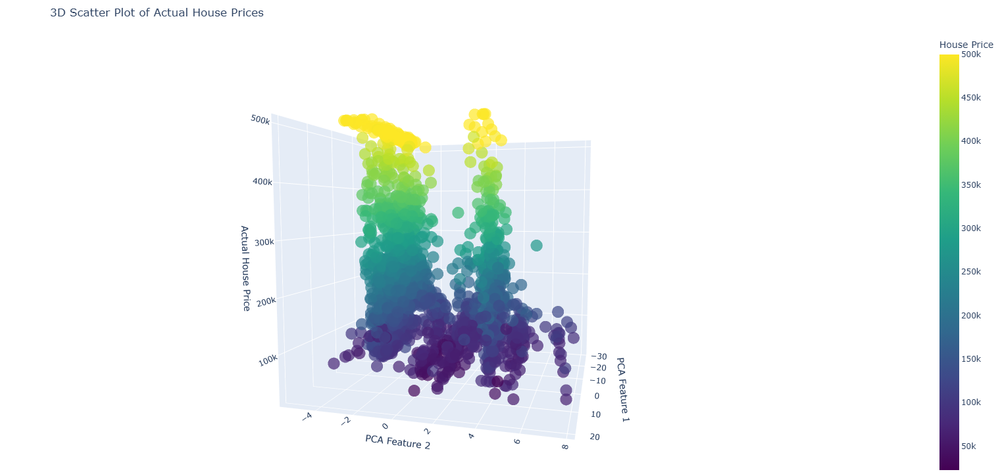
  - [3D_scatter_actual_price](./images/3D_scatter_actual_price1_4.html)
- 3D 曲面图 【html文件，点击查看】
    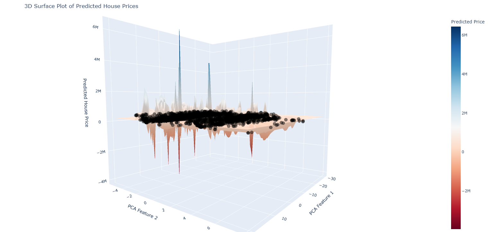
  - [3D_surface_predicted_price](./images/3D_surface_predicted_price1_4.html)
##### 对比总结
- 感知机层数多，则学习率对结果的影响较小
- 感知机层数少，则学习率对结果的影响较大
- 学习率过大，loss 曲线震荡
##### 附：
- pca 组成热力图：
    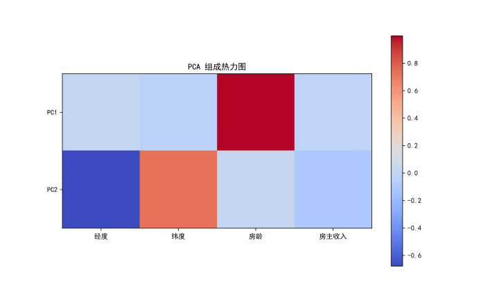
#### 2. 对比`mini-batch`和全量训练的结果
- 选取实验编号 1 和实验编号 3 的结果进行对比
##### 实验编号 1
###### 不使用`mini-batch`训练
- 迭代 2000 代后 loss 的值为  $0.3164235086662772$ 
  - loss 曲线图
    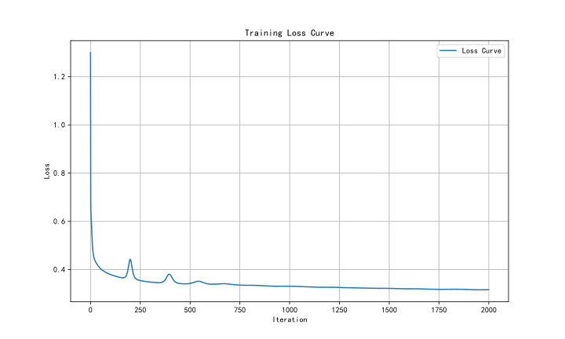
  - 实际值与预测值对比图
    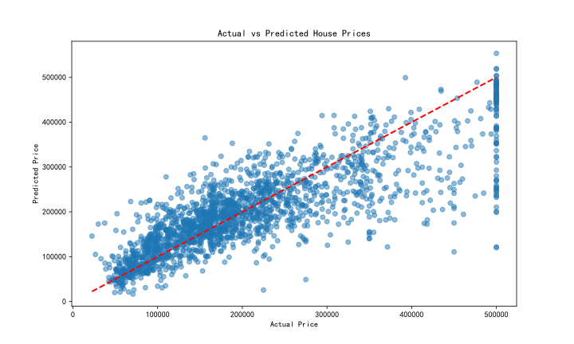
##### 实验编号 3
###### 不使用`mini-batch`训练
- 迭代 2000 代后 loss 的值为  $0.3159459963328876$ 
  - loss 曲线图
    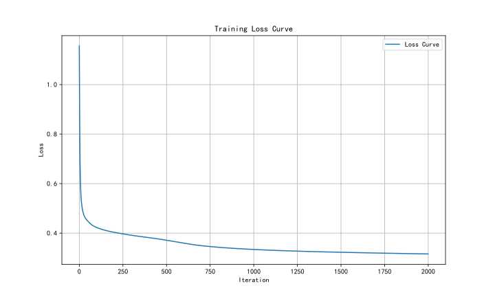
  - 实际值与预测值对比图
    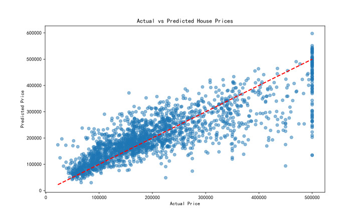
##### 总结
- 使用`mini-batch`训练的结果更好，loss 数值更小，结果更优秀
- 使用全量训练会出现较大的波动，而使用`mini-batch` 波动较小
### 四.参考资料
> - https://plotly.com/python/pca-visualization/
> - https://blog.csdn.net/HLBoy_happy/article/details/77146012?fromshare=blogdetail&sharetype=blogdetail&sharerId=77146012&sharerefer=PC&sharesource=MLLeslie&sharefrom=from_link
