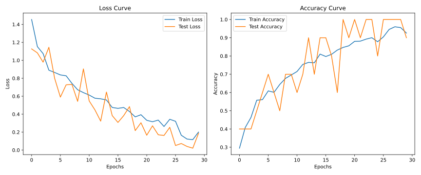
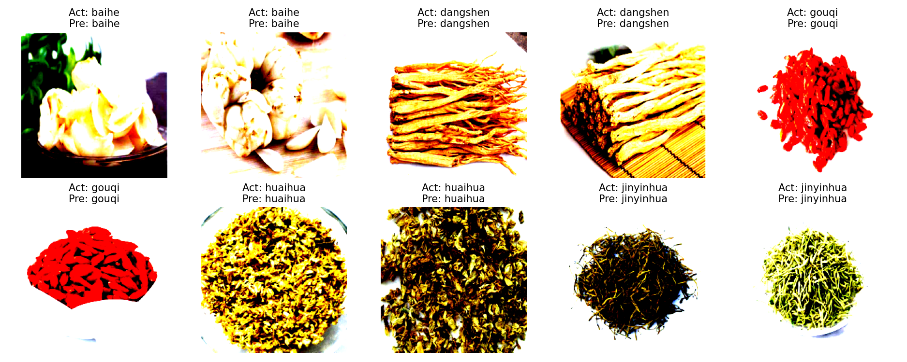

## 📌目录
- [📌目录](#目录)
- [人工智能实验报告 实验五 深度学习](#人工智能实验报告-实验五-深度学习)
  - [一、实验目的](#一实验目的)
  - [二、实验内容](#二实验内容)
    - [1. 算法原理](#1-算法原理)
    - [2. 关键代码展示](#2-关键代码展示)
      - [1. 数据预处理](#1-数据预处理)
      - [2. 数据加载](#2-数据加载)
      - [3. 定义模型](#3-定义模型)
      - [4. 实例化模型](#4-实例化模型)
      - [5. 训练模型\&测试模型](#5-训练模型测试模型)
      - [6. 主函数](#6-主函数)
      - [7. 画图部分](#7-画图部分)
    - [3. 创新点\&优化](#3-创新点优化)
  - [三、实验结果及分析](#三实验结果及分析)
    - [实验结果](#实验结果)
    - [分析](#分析)
      - [损失曲线](#损失曲线)
      - [准确率曲线](#准确率曲线)
    - [总结](#总结)
  - [四、参考文献](#四参考文献)

---

## 人工智能实验报告 实验五 深度学习
### 一、实验目的
- 使用深度学习框架（Pytorch）实现卷积神经网络（CNN）模型，完成图像分类任务。（中药图像数据集）
- 了解卷积神经网络的基本原理，掌握卷积神经网络的基本结构和训练方法。
### 二、实验内容
#### 1. 算法原理
> - 卷积神经网络（CNN）是一种深度学习模型，主要用于图像处理和计算机视觉任务。它通过卷积层、池化层和全连接层等结构来提取图像特征，并进行分类或回归等任务。
> - 卷积层：通过卷积核对输入图像进行卷积操作，提取局部特征。
> - 池化层：对卷积层输出的特征图进行下采样，减少特征图的尺寸，降低计算复杂度。
> - 全连接层：将卷积层和池化层提取的特征进行整合，输出最终的分类结果。
- 具体到实现：
  - 数据预处理
    - 数据集划分已在提供的数据集中完成
    - 数据增强：对训练集图像进行，颜色抖动与标准化
  - 数据加载
    - 根据设定的 [BATCH_SIZE]() 加载数据集，设置随机打乱等参数
  - 定义模型
    - 继承 `torch.nn.Module` 定义卷积神经网络模型
    - 这里定义五个卷积层（每一层经过激活函数及池化）+ 全连接层
  - 实例化模型
    - 实例化模型，定义损失函数（交叉熵损失函数），优化器（Adam优化器）
  - 训练模型
    - 从数据加载器里面根据设定批次加载数据，进行前向传播，计算损失函数，反向传播更新参数
    - 每一次迭代后展示总的损失率和准确率
  - 测试模型
    - 在测试集上进行评估，计算准确率和损失率
- 画图部分见 ↓ [关键代码展示](#2-关键代码展示)
#### 2. 关键代码展示
##### 1. 数据预处理
```py
# 数据预处理
train_transform = transforms.Compose([
    transforms.Resize((IMAGE_SIZE, IMAGE_SIZE)),
    transforms.ColorJitter(brightness=0.2, contrast=0.2), # 随机颜色抖动
    transforms.ToTensor(), 
    transforms.Normalize(mean=[0.485, 0.456, 0.406], std=[0.229, 0.224, 0.225]) # 标准化
])

test_transform = transforms.Compose([
    transforms.Resize((IMAGE_SIZE, IMAGE_SIZE)),
    transforms.ToTensor(), 
    transforms.Normalize(mean=[0.485, 0.456, 0.406], std=[0.229, 0.224, 0.225]) # 标准化
])


data_dir = 'cnn'
train_dir = os.path.join(data_dir, 'train')
test_dir = os.path.join(data_dir, 'test')

train_dataset = ImageFolder(root=train_dir, transform=train_transform)
test_dataset = ImageFolder(root=test_dir, transform=test_transform)
```
- 对训练集和测试集的处理不同，训练集采用颜色抖动及标准化处理，测试集只进行标准化处理
- 然后设置路径将图片传入 `ImageFolder`（加载图像数据集的类，能够自动根据文件夹结构来加载数据） 中，获取训练集和测试集
- 这里的 `ImageFolder` 需要注意的是，数据集的文件夹结构必须是这样的：
    ```bash
    cnn
    ├── test
    │   ├── baihe
    │   │   ├── *.jpg
    │   │   ├── ...
    │   ├── dangshen
    │   │   ├── *.jpg
    │   │   ├── ...
    │   ├── ...
    │   
    └── train
        ├── baihe
        │   ├── *.jpg
        │   ├── ...
        ├── dangshen
        │   ├── *.jpg
        │   ├── ...
        ├── ...
    ```
##### 2. 数据加载
```py
train_loader = torch.utils.data.DataLoader(
    train_dataset,
    batch_size=BATCH_SIZE,
    shuffle=True,
    num_workers=0, 
    pin_memory=True) 
test_loader = torch.utils.data.DataLoader(
    test_dataset, 
    batch_size=BATCH_SIZE, 
    shuffle=False, num_workers=0, 
    pin_memory=True)
```
- 这里的 `DataLoader` 是 PyTorch 中用于加载数据的类，能够自动将数据集划分为批次，并进行随机打乱等操作
- 设置 `BATCH_SIZE` 为 32，表示每个批次加载 32 张图片
- 对于训练集，设置 `shuffle=True`，表示每个 epoch 训练时随机打乱数据顺序（随机打乱数据可以提高模型的泛化能力），对于测试集则不进行打乱
##### 3. 定义模型
```py
# 定义网络模型
class myCNN(nn.Module):
    def __init__(self, num_classes = 5):
        
        super(myCNN, self).__init__()

        # 第一个卷积块
        self.conv1 = nn.Sequential(
            nn.Conv2d(3, 32, kernel_size=3, stride=1, padding=1),
            nn.ReLU(),
            nn.MaxPool2d(kernel_size=2, stride=2)
        )
        
        # 第二个卷积块
        self.conv2 = nn.Sequential(
            nn.Conv2d(32, 64, kernel_size=3, stride=1, padding=1),
            nn.ReLU(),
            nn.MaxPool2d(kernel_size=2, stride=2)
        )
        
        # 第三个卷积块
        self.conv3 = nn.Sequential(
            nn.Conv2d(64, 128, kernel_size=3, stride=1, padding=1),
            nn.ReLU(),
            nn.MaxPool2d(kernel_size=2, stride=2)
        )
        
        # 第四个卷积块
        self.conv4 = nn.Sequential(
            nn.Conv2d(128, 256, kernel_size=3, stride=1, padding=1),
            nn.ReLU(),
            nn.MaxPool2d(kernel_size=2, stride=2)
        )
        
        # 第五个卷积块
        self.conv5 = nn.Sequential(
            nn.Conv2d(256, 512, kernel_size=3, stride=1, padding=1),
            nn.ReLU(),
            nn.MaxPool2d(kernel_size=2, stride=2)
        )
            
        # 定义全连接层
        self.fc_input_size = 512 * 7 * 7


        self.fc = nn.Sequential(
            nn.Linear(self.fc_input_size, 1024),
            nn.ReLU(),
            nn.Dropout(0.5),
            nn.Linear(1024, 512),
            nn.ReLU(),
            nn.Dropout(0.5),
            nn.Linear(512, num_classes)
        )

        # 初始化权重
        for m in self.modules():
            if isinstance(m, nn.Conv2d):
                nn.init.kaiming_normal_(m.weight, mode='fan_out', nonlinearity='relu')
            elif isinstance(m, nn.Linear):
                nn.init.normal_(m.weight, mean=0, std=0.01)
                nn.init.constant_(m.bias, 0)
            elif isinstance(m, nn.BatchNorm2d):
                nn.init.constant_(m.weight, 1)
                nn.init.constant_(m.bias, 0)

    def forward(self, x):
        x = self.conv1(x)
        x = self.conv2(x)
        x = self.conv3(x)
        x = self.conv4(x)
        x = self.conv5(x)
        x = x.view(x.size(0), -1)  # 展平
        self.fc_input_size = x.size(1)
        x = self.fc(x)
        return x
```
- 这里定义了一个卷积神经网络模型 `myCNN`，包含五个卷积块和全连接层，每个卷积块由卷积层、激活函数（ReLU）和池化层组成
- 以第一个卷积块为例：
  - `nn.Conv2d(3, 32, kernel_size=3, stride=1, padding=1)`：输入通道数为 3（RGB 图像），输出通道数为 32，卷积核大小为 3x3，步长为 1，padding 为 1（保持图像大小不变）
    
    - *图源 [Convolution_schematic](http://ufldl.stanford.edu/tutorial/supervised/FeatureExtractionUsingConvolution/)*
  - `nn.ReLU()`：激活函数，增加非线性  $f(x) = max(0 ,x)$ 
  - `nn.MaxPool2d(kernel_size=2, stride=2)`：池化层，池化核大小为 2x2，步长为 2（下采样）
    - 什么叫下采样？通过池化操作，减少特征图的尺寸，降低计算复杂度（如果直接使用卷积层，特征图的尺寸会变得很大，对计算资源的负担很大，也容易过拟合，所以考虑计算图像某个区域上特定特征的平均值（或最大值），这样汇总的统计数据维度会小很多）
      
      - *图源 [Pooling_schematic](http://ufldl.stanford.edu/tutorial/supervised/Pooling/)*
- 全连接层：`self.fc = nn.Sequential(...)`，包含三个全连接层，使用 ReLU 激活函数和 Dropout（防止过拟合）
##### 4. 实例化模型
```py
# 实例化模型，定义损失函数和优化器
model = myCNN(num_classes=len(train_dataset.classes)).to(device)
criterion = nn.CrossEntropyLoss() # 交叉熵损失函数 
optimizer = optim.Adam(model.parameters(), lr=LEARNING_RATE) # Adam优化器 
```
- 损失函数：使用交叉熵损失函数（`nn.CrossEntropyLoss()`），在多分类问题中常用。其中 $y$  为真实标签，$\hat{y}$ 为预测值，$N$ 为样本数， $C$ 为类别数， $y_{ij}$ 为第 $i$ 个样本的第 $j$ 个类别的真实标签（one-hot 编码），$\hat{y}_{ij}$ 为第 $i$ 个样本的第 $j$ 个类别的预测值
```math
L(y, \hat{y}) = -\frac{1}{N} \sum_{i=1}^{N} \sum_{j=1}^{C} y_{ij} \log(\hat{y}_{ij}) \\
```
- 优化器：优化器的作用是更新模型的参数，使得损失函数最小化。这里使用 Adam 优化器（`optim.Adam()`），它是一种自适应学习率优化算法，能够根据每个参数的历史梯度信息自动调整学习率
##### 5. 训练模型&测试模型
- 训练模型和测试模型的大体思维相似
    ```py
    # 训练函数
    def train(model, train_loader, criterion, optimizer, device):
        model.train()
        running_loss = 0.0
        correct = 0
        total = 0

        for images, labels in train_loader:
            images, labels = images.to(device), labels.to(device)

            # 梯度清零
            optimizer.zero_grad()

            # 前向传播
            outputs = model(images)
            loss = criterion(outputs, labels)
            
            # 反向传播
            loss.backward() 
            optimizer.step() # 更新参数
        
            # 计算损失和准确率
            running_loss += loss.item() * images.size(0)
            _, predicted = torch.max(outputs.data, 1)
            total += labels.size(0)
            correct += (predicted == labels).sum().item()

        epoch_loss = running_loss / len(train_loader.dataset)
        epoch_acc = correct / total

        return epoch_loss, epoch_acc

    def test(model, test_loader, criterion, device):
        model.eval()
        running_loss = 0.0
        correct = 0
        total = 0

        with torch.no_grad():
            for images, labels in test_loader:
                images, labels = images.to(device), labels.to(device)

                # 前向传播
                outputs = model(images)
                loss = criterion(outputs, labels)

                # 计算损失和准确率
                running_loss += loss.item() * images.size(0)
                _, predicted = torch.max(outputs.data, 1)
                total += labels.size(0)
                correct += (predicted == labels).sum().item()

        epoch_loss = running_loss / len(test_loader.dataset)
        epoch_acc = correct / total

        return epoch_loss, epoch_acc
    ```
- 损失率的计算：
    - `running_loss += loss.item() * images.size(0)`：将每个批次的损失乘以批次大小，累加到 `running_loss` 中
    - `epoch_loss = running_loss / len(train_loader.dataset)`：将总损失除以数据集大小，得到平均损失率
- 准确率的计算：
  - `_, predicted = torch.max(outputs.data, 1)`：通过列方向寻找每个标签的预测值的最大值，获取每个样本的预测类别（返回值是一个元组(最大值，索引)，这里只需要索引）
  - `total += labels.size(0)`：累加总样本数
  - `correct += (predicted == labels).sum().item()`：累加预测正确的样本数
  - `epoch_acc = correct / total`：计算平均准确率
- 测试函数中的 `with torch.no_grad()`：由于测试不需要反向传播，所以使用 `torch.no_grad()` 来关闭梯度计算，这样可以节省内存和计算资源
##### 6. 主函数
```py
if __name__ == "__main__":

    # 其它代码...

    for epoch in range(TRAIN_EPOCHS):
            # 训练
            train_loss, train_acc = train(model, train_loader, criterion, optimizer, device)
            train_losses.append(train_loss)
            train_accuracies.append(train_acc)

            # 测试
            test_loss, test_acc = test(model, test_loader, criterion, device)
            test_losses.append(test_loss)
            test_accuracies.append(test_acc)

            # 保存最佳模型
            if test_acc > best_acc:
                best_acc = test_acc
                torch.save(model.state_dict(), 'best_model.pth')
                print(f"保存最佳模型，准确率: {best_acc:.4f}")
            
            # 打印训练和测试结果
            print(f"Epoch [{epoch+1}/{TRAIN_EPOCHS}], "
                f"Train Loss: {train_loss:.4f}, Train Acc: {train_acc:.4f}, "
                f"Test Loss: {test_loss:.4f}, Test Acc: {test_acc:.4f}")
            

        end_time = time.time()
        print(f"训练完成，耗时: {end_time - start_time:.2f}秒")
        print(f"最佳测试准确率: {best_acc:.4f}")

    # 画图部分...
```
- 训练和测试函数的调用在主函数中进行，使用 `for` 循环进行多次迭代（epoch），每次迭代都进行训练和测试
- `train_losses` 和 `train_accuracies` 用于存储每个 epoch 的训练损失和准确率，`test_losses` 和 `test_accuracies` 用于存储每个 epoch 的测试损失和准确率
- `best_acc` 用于保存最佳测试准确率，一旦有新的最佳准确率，就保存模型参数到 `best_model.pth` 文件中，后续画图时使用
##### 7. 画图部分
```py
if __name__ == "__main__":

    # 其它代码...

    # 加载最佳模型
    model.load_state_dict(torch.load('best_model.pth'))

    # 绘制图表
    plt.figure(figsize=(12, 5))

    # 损失曲线
    plt.subplot(1, 2, 1)
    plt.plot(train_losses, label='Train Loss')
    plt.plot(test_losses, label='Test Loss')
    plt.title('Loss Curve')
    plt.xlabel('Epochs')
    plt.ylabel('Loss')
    plt.legend()

    # 准确率曲线
    plt.subplot(1, 2, 2)
    plt.plot(train_accuracies, label='Train Accuracy')
    plt.plot(test_accuracies, label='Test Accuracy')
    plt.title('Accuracy Curve')
    plt.xlabel('Epochs')
    plt.ylabel('Accuracy')
    plt.legend()

    plt.tight_layout()
    plt.savefig('training_curve.svg')
    plt.show()

    # 模型评估展示
    images, labels = next(iter(test_loader))
    images, labels = images.to(device), labels.to(device)

    outputs = model(images)
    _, predicted = torch.max(outputs.data, 1)

    # 数据迁回CPU
    images = images.cpu()
    labels = labels.cpu()
    predicted = predicted.cpu()

    # 获取类别
    classes_names = test_dataset.classes

    # 显示图片和预测结果
    num_images = 10
    images_pre_row = num_images // 2
    num_rows = 2

    plt.figure(figsize=(15, 6))
    for i in range(num_images):
        plt.subplot(num_rows, images_pre_row, i + 1)
        plt.imshow(images[i].permute(1, 2, 0).numpy())
        plt.title(f"Act: {classes_names[labels[i]]}\nPre: {classes_names[predicted[i]]}")
        plt.axis('off')
    plt.tight_layout()
    plt.show()
    plt.savefig('predictions.svg')
```
- 主要有两个图：第一个图包括两个子图：损失率曲线和准确率曲线，第二个图是模型评估展示，显示了测试集上前 10 张图片的真实标签和预测标签
#### 3. 创新点&优化
- 使用调度器（`StepLR` 或者 `ReduceLROnPlateau`）来调整学习率，能够在训练过程中动态调整学习率，提高模型的收敛速度和准确率
- 数据处理的时候加入了颜色抖动（`ColorJitter`），对测试集的训练结果更好
- 创建加载器的时候设置了 `pin_memory=True`，可以加速数据加载
### 三、实验结果及分析
#### 实验结果
> - 训练参数：
>   - 批次大小：32
>   - 学习率：0.001
>   - 训练轮数：30
> - 此处展示最优实验结果
- 最佳结果：`Epoch [29/30], Train Loss: 0.1162, Train Acc: 0.9557, Test Loss: 0.0213, Test Acc: 1.0000`
- 曲线：
    
- 结果展示：
    
#### 分析
##### 损失曲线
- 训练损失率和测试损失率都随着迭代次数的增加而逐渐减小，说明模型在训练过程中逐渐学习到了数据的特征
- 训练集损失率的波动较测试集的小，测试集由于只有 10 张图片，所以波动较大
- 在接近迭代次数 30 时，发生回升，说明模型可能出现了过拟合现象，所以前面将训练轮数设置为 30 次
##### 准确率曲线
- 可以看到训练集的准确率曲线上升非常完美，说明模型在训练集上拟合得很好
- 测试集的准确率曲线也在逐渐上升，但是波动很大，思考是因为测试集只有 10 张图片，准确率只有 10 个数值，也有可能是批次大小设置得太小，导致模型在测试集上表现不稳定
#### 总结
- 整个实验中，模型的训练和测试结果都比较理想，准确率达到了 100%，说明模型在这个数据集上表现良好
### 四、参考文献
> - [PyTorch 官方文档](https://pytorch.org/docs/stable/index.html)
> - http://ufldl.stanford.edu
> - https://data.mendeley.com/datasets/2kjmzjyrmd/3