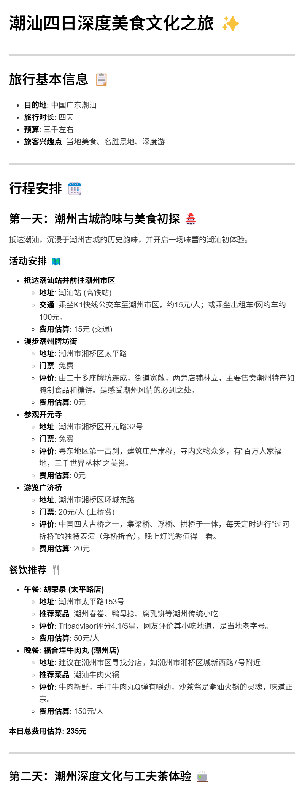
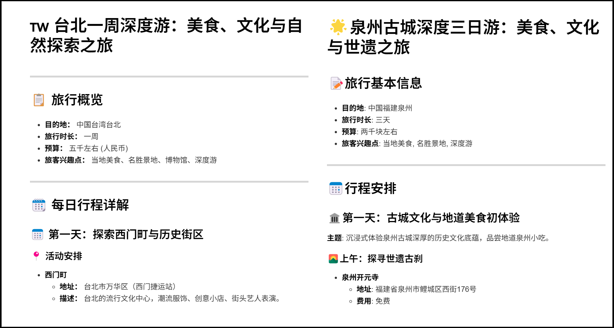

## 📌目录
- [📌目录](#目录)
- [人工智能实验报告 LangGraph多智能体协作](#人工智能实验报告-langgraph多智能体协作)
  - [一、实验目的](#一实验目的)
  - [二、实验内容](#二实验内容)
    - [1. 背景\&算法原理](#1-背景算法原理)
    - [2. 关键代码展示](#2-关键代码展示)
      - [1. 状态定义 (AgentState)](#1-状态定义-agentstate)
      - [2. 定义工具 (Tools)](#2-定义工具-tools)
      - [3. 结构化输出（Pydantic Models）](#3-结构化输出pydantic-models)
      - [4. 智能体节点 (Agents)](#4-智能体节点-agents)
        - [(1) chief\_planner\_agent](#1-chief_planner_agent)
        - [(2) expert\_agent\_react](#2-expert_agent_react)
        - [(3) report\_generator\_agent](#3-report_generator_agent)
      - [5. 定义图 (Graph)](#5-定义图-graph)
      - [6. 主函数调用](#6-主函数调用)
    - [3. 创新点\&优化](#3-创新点优化)
  - [三、实验结果及分析](#三实验结果及分析)
    - [实验结果](#实验结果)
    - [分析](#分析)
    - [潜在问题](#潜在问题)
  - [四、参考文献](#四参考文献)

---

## 人工智能实验报告 LangGraph多智能体协作

### 一、实验目的

  - 使用 LangChain 和 LangGraph 框架设计并实现一个多智能体（Multi-Agent）协作系统，完成一个复杂的、多步骤的旅行计划定制任务。
  - 深入理解和应用智能体设计的核心模式，包括 ReAct（Reasoning and Acting）、Reflection（反思修正）以及工具（Tools）调用。
  - 掌握使用状态图（StateGraph）来构建和控制非线性的、可循环的复杂智能体工作流，实现智能体之间的有效协同和任务路由。

### 二、实验内容

#### 1\. 背景&算法原理

- 本实验构建了一个**模拟高端旅行定制工作室**的 AI 系统，该系统由多个拥有不同职责的智能体组成。它们在一个预定义的图（Graph）结构中协同工作，共同完成从用户需求分析到生成最终报告的全过程。
- **多智能体协作 (Multi-Agent Collaboration)**：系统包含四种核心智能体：
  - **总监 (ChiefPlanner)**：作为团队的管理者，负责解析用户初始需求、审查下属工作、提供反馈（Reflection），并决定任务的下一步走向。
  - **行程专家 (ItineraryExpert)**：负责规划详细的每日行程，利用工具搜索景点、餐厅等信息。
  - **后勤专家 (LogisticsExpert)**：负责规划住宿和交通，确保方案符合预算。
  - **报告专员 (ReportGenerator)**：负责将最终确定的计划整合成一份精美的Markdown报告。
- **工具调用 (Tool Invocation)**：智能体通过调用预定义的工具来获取外部信息或执行特定操作。智能体在调用工具后会根据返回的结果进行下一步的思考和决策。
  - 这里我设置的工具有：
    - `tavily_search`：用于在线搜索信息。
    - `search_long_term_memory`：从长期记忆中检索相关信息。
    - `add_to_long_term_memory`：将新的旅行计划存入长期记忆。
    - `calculator`：用于执行简单的数学计算。（主要是计算花费防止超支）
    - `generate_markdown_report`：将结构化的旅行计划转换为 Markdown 格式报告。
- **状态图 (StateGraph)**：与传统的线性链式调用不同，本实验采用 LangGraph 的 `StateGraph` 来定义工作流程。图中的每个节点代表一个智能体或一个操作，边则代表状态的流转。这种结构允许实现复杂的逻辑，例如将任务从专家返回给总监进行审查，形成一个“反思-修改”的循环，极大地提升了计划的质量。
- **ReAct 框架**：行程和后勤专家采用 ReAct 模式工作。它们遵循“**思考 → 行动 → 观察**”的循环。首先，智能体基于当前任务进行**思考**，决定需要什么信息以及使用哪个**行动**（工具）。在执行工具并获得**观察**（结果）后，智能体将新信息融入下一轮思考，直到任务完成。
- **长期记忆 (Long-Term Memory)**：系统设计了简单的长期记忆机制。在总监批准一份计划后，该计划会被存入一个 JSON 文件。当接到新的相似目的地请求时，系统可以从记忆中检索并复用已有计划，提高了效率。

#### 2\. 关键代码展示

##### 1\. 状态定义 (AgentState)

`AgentState` 是整个工作流的核心，它以一个字典的形式在所有节点间传递，承载了任务执行所需的所有信息。

```py
class AgentState(TypedDict):
    user_request: str                 # 用户的原始请求
    user_profile: Dict                # 提取出的用户核心偏好 (模拟长期记忆)
    plan: Dict                        # 存储旅行计划的结构化数据
    drafts: List[Dict]                # 各个智能体的草稿和思考过程
    reflection: Dict                  # 总监的反思和修改意见
    final_report: str                 # 最终的Markdown报告
    next_agent: str                   # 决定下一个执行的智能体
```

  - 通过统一的状态管理，每个智能体都能访问到全局信息，例如用户偏好、其他智能体已完成的草稿等，保证了协作的顺畅。
  - `next_agent` 字段是实现动态路由的关键，由智能体在完成工作后设置，指导图的走向。

##### 2\. 定义工具 (Tools)

工具是智能体与外部世界交互的桥梁。本实验定义了多种工具，例如在线搜索、计算器、长期记忆读写等。

```py
@tool
def tavily_search(query: str) -> str:
    """
    使用Tavily搜索引擎在线查找信息。
    """
    # ... 实现代码 ...

@tool
def search_long_term_memory(destination: str) -> Union[Dict, str]:
    """
    从长期记忆中搜索关于特定目的地的旅行计划。
    """
    # ... 实现代码 ...

@tool
def add_to_long_term_memory(destination: str, plan_data: Dict) -> str:
    """
    将一个新的旅行计划添加到长期记忆中。
    """
    # ... 实现代码 ...

@tool
def calculator(expression: str) -> str:
    """
    一个简单的计算器工具，可以执行基本的数学运算。
    """
    # ... 实现代码 ...

@tool
def generate_markdown_report(plan: Dict) -> str:
    """
    使用LLM将结构化的旅行计划字典转换成Markdown格式报告（中文），并将其保存为文件。
    """
    # ... 实现代码 ...
```

  - 每个工具都被 `@tool` 装饰器标记，使其能被 LangChain 框架自动识别和调用。
  - 专家智能体通过调用这些工具来获取制定计划所需的数据。
- 这里报告生成工具 `generate_markdown_report` 其实也调用了 LLM，下面展示提示词
    ```py
    @tool
    def generate_markdown_report(plan: Dict) -> str:
        """
        使用LLM将结构化的旅行计划字典转换成Markdown格式报告（中文），并将其保存为文件。
        """
        print("--- TOOL: GENERATE MARKDOWN REPORT ---")
        
        prompt = f"""
        作为一名专业的旅行计划书撰写专家，请将以下旅行计划数据转换为美观、易读的中文Markdown格式报告。
        
        ## 旅行基本信息
        - 目的地: {plan['destination']}
        - 旅行时长: {plan['duration']}
        - 预算: {plan['budget']}
        - 旅客兴趣点: {', '.join(plan['interests'])}
        
        ## 行程安排
        {json.dumps(plan.get('itinerary', {}), ensure_ascii=False, indent=2)}
        
        ## 后勤信息
        {json.dumps(plan.get('logistics', {}), ensure_ascii=False, indent=2)}
        
        ## 备选方案
        {json.dumps(plan.get('alternatives', {}), ensure_ascii=False, indent=2)}
        
        请生成一份完整的、结构清晰的Markdown格式旅行计划，确保:
        1. 包含精美的标题和小标题（可以添加相关的图标或样式）
        2. 为每日行程添加详细描述，包括主题、活动和餐饮建议（详细）
        3. 格式化所有费用信息，使其易于阅读
        4. 将餐饮建议格式化为易读的列表，包含菜品推荐和评价（详细）
        5. 后勤部分应清晰展示住宿和交通信息
        6. 使用Markdown语法确保内容美观、层次分明
        
        只需返回纯Markdown格式，不要添加任何解释或前导语。
        """
        
        messages = [HumanMessage(content=prompt)]
        response = llm.invoke(messages)
        markdown_report = response.content

        try:
            filename = f"旅行计划_{plan.get('destination', '未知目的地')}.md"
            with open(filename, 'w', encoding='utf-8') as f:
                f.write(markdown_report)
            print(f"--- TOOL: REPORT EXPORTED --- \nSaved to: {filename}")
        except Exception as e:
            print(f"--- TOOL: REPORT EXPORT FAILED --- \nError: {e}")
        
        return markdown_report
    ```
##### 3\. 结构化输出（Pydantic Models）
为了确保智能体的输出符合预期格式，我们使用 Pydantic 定义了结构化的输出模型。

```py
class PlanDecision(BaseModel):
    """用于解析初始用户请求的结构。"""
    destination: str = Field(description="旅行目的地")
    duration: str = Field(description="旅行时间")
    budget: str = Field(description="旅行预算")
    interests: List[str] = Field(description="客户的兴趣点")
    next_agent: AgentType = Field(description="下一个应该开始工作的专家", default=AgentType.ITINERARY_EXPERT)

class ReviewDecision(BaseModel):
    """用于解析总监审查决策的结构。"""
    decision: str = Field(description="审查决定，'APPROVE' 或 'REVISE'")
    feedback: Union[str, None] = Field(description="如果决定是 'REVISE'，请提供具体的修改意见", default=None)
    next_agent: AgentType = Field(description="下一个智能体：'ReportGenerator' (如果批准) 或需要修改的专家 (如果修改)")
```

  - `PlanDecision` 用于解析总监智能体对用户请求的初步分析结果，包含目的地、预算等关键信息。
  - `ReviewDecision` 用于总监审查下属提交的计划草稿，决定是否批准或需要修改。


##### 4\. 智能体节点 (Agents)

- 每个智能体被实现为一个函数，接收并返回 `AgentState`。

###### (1) chief_planner_agent

总监智能体负责解析用户请求、审查专家提交的草稿，并决定下一步行动。

```py
def chief_planner_agent(state: AgentState) -> AgentState:
    """
    总监智能体 (ChiefPlanner)
    - 接收用户请求，提取核心信息
    - 审查草稿，提供反馈 (实现Reflection)
    - 决定下一步行动
    """
    if not state.get("plan"): # 任务开始
        parser = PydanticOutputParser(pydantic_object=PlanDecision)
        prompt = f"""
        你是一个高端旅行工作室的总监。你的任务是分析客户的初始请求，并委派任务给你的团队。
        
        客户请求: "{state['user_request']}"
        
        你的工作:
        1.  从请求中提取关键信息：目的地、时间、预算、个人兴趣等等。
        2.  决定下一步应该由哪个专家开始工作。
        
        {parser.get_format_instructions()}
        """
        # 创建链并调用
        chain = llm | parser
        parsed_output = chain.invoke(prompt)

        # 更新状态
        state["user_profile"] = {
            "destination": parsed_output.destination,
            "duration": parsed_output.duration,
            "budget": parsed_output.budget,
            "interests": parsed_output.interests
        }
        state["plan"] = {}
        
        print(f"--- CHIEF PLANNER: Checking long-term memory for {parsed_output.destination} ---")
        memory_result = search_long_term_memory.invoke({"destination": parsed_output.destination})
        
        if isinstance(memory_result, dict):
            print("--- CHIEF PLANNER: Found existing plan in memory. Using it as a base. ---")
            state['plan'] = memory_result.get('plan', {})
            state["next_agent"] = AgentType.CHIEF_PLANNER.value
        else:
            print("--- CHIEF PLANNER: No existing plan found. Starting from scratch. ---")
            state["next_agent"] = parsed_output.next_agent.value
        
    else: # Reflection
        itinerary_done = 'itinerary' in state['plan']
        logistics_done = 'logistics' in state['plan']
        
        if not itinerary_done:
             state["next_agent"] = AgentType.ITINERARY_EXPERT.value
             return state
        if not logistics_done:
            state["next_agent"] = AgentType.LOGISTICS_EXPERT.value
            return state

        parser = PydanticOutputParser(pydantic_object=ReviewDecision)
        prompt = f"""
        你是一个高端旅行工作室的总监，正在审查下属提交的旅行计划草稿。
        
        客户核心档案: {state['user_profile']}
        
        当前计划草稿: {state['plan']}
        
        你的任务 (Reflection):
        1. 检查 'itinerary' 是否详细且符合客户的兴趣({state['user_profile']['interests']})。
        2. 检查每个景点是否提供了地址，餐饮是否包含网友评论。
        3. 审查费用估算是否合理，每日费用总和是否在客户预算({state['user_profile']['budget']})范围内。
        4. 检查 'logistics' 的建议是否符合客户的预算。
        5. 如果一切都好，请决定下一步进入报告生成环节。输出 "APPROVE"。
        6. 如果有问题，请提出具体的修改意见和需要返工的专家名称。

        {parser.get_format_instructions()}
        """
        chain = llm | parser
        parsed_output = chain.invoke(prompt)

        if parsed_output.decision.upper() == "REVISE":
            state["next_agent"] = parsed_output.next_agent.value
            state['reflection'] = {"feedback": parsed_output.feedback}
        else:
            print("--- CHIEF PLANNER: Plan approved. Saving to long-term memory before generating report. ---")
            add_to_long_term_memory.invoke({
                "destination": state["user_profile"]["destination"],
                "plan_data": {
                    "user_profile": state["user_profile"],
                    "plan": state["plan"]
                }
            })
            state["next_agent"] = AgentType.REPORT_GENERATOR.value

    return state
```
  - 总监智能体大致分为两个部分：
    - **任务分配**：在任务开始时，解析用户请求，提取关键信息，并决定下一个执行的智能体。
    - **审查与反思**：在任务完成后，审查专家智能体提交的草稿，决定是否批准或需要修改，并提供反馈。
  - 为了方便，利用 `llm | parser` 的方式创建了一个**链（chain）**，将 LLM 和 Pydantic 输出解析器连接起来，简化了输出的处理。
  - 在初始解析的时候，**先检查**长期记忆中是否已有相关的旅行计划。如果有，则再次调用总监智能体的逻辑来决定是否复用已有计划，避免重复劳动。（也避免由于时间跨度过大导致的计划过时问题），如果没有，则开始新的规划流程。
  - 在审查阶段，先总体判断两个部分：`itinerary` 和 `logistics` 是否完成，若没有完成则直接返回需要执行的智能体类型。如果都完成了，则进入**审查逻辑**，检查计划的细节是否符合用户需求，并决定下一步行动。
  
###### (2) expert_agent_react

行程和后勤专家智能体采用 ReAct 模式工作，负责具体的计划制定。

```py
def expert_agent_react(state: AgentState, agent_name: str) -> AgentState:
    """
    专家智能体 (行程/后勤)
    - 使用 ReAct 模式: 思考 -> 行动(工具) -> 观察 -> 回答
    - 它只负责自己领域内的规划。
    """
    task_description = ""
    if agent_name == "ItineraryExpert":
        task_description = f"""
        为期 {state['user_profile']['duration']} 的 {state['user_profile']['destination']} 之旅，规划一份详细的每日行程。
        客户对 {state['user_profile']['interests']} 特别感兴趣。
        总预算为 {state['user_profile']['budget']}。
        
        你需要：
        1. 为每个景点或地点查找并提供详细地址
        2. 为推荐的餐厅或小吃查找并提供真实的网友评论
        3. 估算每个活动和餐饮的费用，并计算每日总花费，确保不超过总预算
        """
        # 如果有总监的修改意见，加入到提示中
        if state.get('reflection') and 'ItineraryExpert' in state['reflection'].get('feedback', ''):
            task_description += f"\n修改意见: {state['reflection']['feedback']}"
            state['reflection'] = {} # 清除意见
            
    elif agent_name == "LogisticsExpert":
        task_description = f"""
        为 {state['user_profile']['destination']} 的旅行提供住宿和交通建议，总预算为 {state['user_profile']['budget']}。
        请提供住宿的具体地址、价格，以及从一个地点到另一个地点的交通方式和费用估算。
        """

    # ReAct Prompt
    prompt = f"""
    你是 {agent_name}。你的任务是: {task_description}
    
    请遵循"思考 -> 行动 -> 观察 -> 回答"的模式 (ReAct)。
    首先，你需要思考你需要哪些信息，然后使用你可用的工具({tavily_search.name}, {calculator.name})来查找这些信息或进行计算。
    在你收集到足够的信息后，请以JSON格式总结你的最终规划方案。JSON必须包含在一个代码块中。
    
    例如, 对于 ItineraryExpert, 最终的JSON输出格式应为:
    ```json
    {{
      "itinerary": {{
        "第一天": {{ "theme": "...", "activities": ["...", "..."], "dining_suggestion": "..." }},
        "第二天": {{ "theme": "...", "activities": ["...", "..."], "dining_suggestion": "..." }}
      }},
      "alternatives": {{ "备选活动": "..." }}
    }}
    ㅤ```  
    
    对于 LogisticsExpert, 最终的JSON输出格式应为:
    ```json
    {{
      "logistics": {{
        "accommodation": "...",
        "transportation": "..."
      }},
      "alternatives": {{ "备选酒店": "..." }}
    }}
    ㅤ```

    现在，请开始你的工作。先思考，然后决定是否需要调用工具。
    """
    
    # ReAct 循环
    llm_with_tools = llm.bind_tools([tavily_search, calculator])
    messages = [HumanMessage(content=prompt)]
    for i in range(5): # 最多进行5轮
        print(f"\n--- {agent_name} ReAct Loop: Step {i+1} ---")
        
        response = llm_with_tools.invoke(messages)
        messages.append(response) # 将模型的响应加入历史记录

        # 检查模型是否要调用工具 (行动)
        if response.tool_calls:
            print(f"--- ReAct: Tool call detected by the model. ---")
            for tool_call in response.tool_calls:
                # 执行工具
                if tool_call['name'] == tavily_search.name:
                    tool_result = tavily_search.invoke(tool_call["args"])
                elif tool_call['name'] == calculator.name:
                    tool_result = calculator.invoke(tool_call["args"])
                else:
                    tool_result = "未知工具"
                    
                print(f"--- ReAct: Tool '{tool_call['name']}' executed. ---")
                # 将观察结果加入历史记录
                messages.append(ToolMessage(content=str(tool_result), tool_call_id=tool_call["id"]))
            continue

        # 如果没有工具调用，则认为是最终回答
        print("--- ReAct: No tool call detected. Assuming final answer. ---")
        json_match = re.search(r"```json\n(.*?)\n```", response.content, re.DOTALL)
        if json_match:
            plan_json_str = json_match.group(1)
            try:
                plan_update = json.loads(plan_json_str)
                state["plan"].update(plan_update)
                state["next_agent"] = AgentType.CHIEF_PLANNER.value
                print("--- ReAct: Successfully parsed final JSON answer. ---")
                return state
            except json.JSONDecodeError as e:
                print(f"--- ReAct: Error decoding JSON: {e} ---")
                # 告知模型JSON错误，让其修正
                error_message = HumanMessage(content=f"你的JSON格式有误，请修正: {e}")
                messages.append(error_message)
                continue

        # 如果既没有工具调用也没有有效JSON，让它再试一次
        print("--- ReAct: No valid action or final answer detected, retrying... ---")

    # 如果循环结束仍未得到有效结果
    print(f"--- {agent_name}: Failed to get a valid plan after multiple attempts. ---")
    state["next_agent"] = AgentType.CHIEF_PLANNER.value  # 返回给总监处理
    return state
```

- `expert_agent_react` 其实是一个通用的专家智能体函数，它根据传入的 `agent_name` 参数来决定是行程专家还是后勤专家。
  - **行程专家**：负责制定每日行程，搜索景点和餐饮信息，并计算费用。
  - **后勤专家**：负责规划住宿和交通，确保符合预算。
- 使用 ReAct 模式，智能体在每一步都先思考需要什么信息，然后调用工具获取数据，最后将结果以 JSON 格式返回。
  - 在每次循环中，智能体会检查是否需要调用工具（行动），如果有，则执行工具并将结果作为观察（Observation）加入到对话历史中。
  - 如果没有工具调用，则认为是最终回答，并尝试解析 JSON 输出，将结果更新到 `state["plan"]` 中。
- 不管有没有产生满意的输出，智能体会返回给总监进行处理。（决定权归回总监）


###### (3) report_generator_agent
报告生成智能体负责将最终的旅行计划转换为 Markdown 格式的报告。

```py
def report_generator_agent(state: AgentState) -> AgentState:
    """
    报告生成专员
    - 调用自定义工具，将最终确认的计划格式化为Markdown
    """
    print("\n--- AGENT: ReportGenerator ---")
    
    complete_plan = {
        "destination": state["user_profile"]["destination"],
        "duration": state["user_profile"]["duration"],
        "budget": state["user_profile"]["budget"],
        "interests": state["user_profile"]["interests"]
    }

    complete_plan.update(state['plan'])
    

    markdown_report = generate_markdown_report.invoke({"plan": complete_plan})
    state['final_report'] = markdown_report
    state['next_agent'] = AgentType.END.value  # 任务结束
    return state
```
- `report_generator_agent` 负责将最终的旅行计划转换为 Markdown 格式的报告，并将其保存到文件中。

##### 5\. 定义图 (Graph)

使用 `StateGraph` 将所有智能体节点连接起来，并定义它们之间的跳转逻辑。

```py
workflow = StateGraph(AgentState)

# 添加节点
workflow.add_node("ChiefPlanner", chief_planner_agent)
workflow.add_node("ItineraryExpert", lambda state: expert_agent_react(state, "ItineraryExpert"))
workflow.add_node("LogisticsExpert", lambda state: expert_agent_react(state, "LogisticsExpert"))
workflow.add_node("ReportGenerator", report_generator_agent)

# 设置入口点
workflow.set_entry_point("ChiefPlanner")

# 定义条件边，实现动态路由
workflow.add_conditional_edges(
    "ChiefPlanner",
    route_tasks, # 一个根据 state['next_agent'] 返回节点名的函数
    {
        "ItineraryExpert": "ItineraryExpert",
        "LogisticsExpert": "LogisticsExpert",
        "ReportGenerator": "ReportGenerator",
    }
)

# 定义常规边，专家完成后返回总监审查
workflow.add_edge("ItineraryExpert", "ChiefPlanner")
workflow.add_edge("LogisticsExpert", "ChiefPlanner")

# 报告生成后结束
workflow.add_edge("ReportGenerator", END)

# 编译图
graph = workflow.compile()
```
- `add_conditional_edges` 是构建复杂工作流的核心。它允许图根据总监（或任何其他节点）的决策动态地将任务路由到不同的下一个节点，从而实现审查、返工等循环逻辑。
    ```mermaid
    stateDiagram-v2
        [*] --> ChiefPlanner

        ChiefPlanner --> ItineraryExpert : next_agent == ItineraryExpert
        ChiefPlanner --> LogisticsExpert : next_agent == LogisticsExpert
        ChiefPlanner --> ReportGenerator : next_agent == ReportGenerator

        ItineraryExpert --> ChiefPlanner
        LogisticsExpert --> ChiefPlanner
        ReportGenerator --> [*]
    ```

##### 6\. 主函数调用

在主函数中，我们初始化状态并调用编译好的图。

```py
def main():
    initial_request = "你好，我和我男朋友想去中国广东潮汕玩四天。预算在三千左右。我们对当地美食非常感兴趣，同时也想参观当地一些名胜景地，希望能有一个深度游的体验。"
    
    initial_state = AgentState(...)
    
    # 使用 stream 方法执行图，可以观察每一步的输出
    for output in graph.stream(initial_state, config={"recursion_limit": 100}):
        if "__end__" not in output:
            for key, value in output.items():
                print(f"--- Node '{key}' Output ---")
                final_state = value
    
    # 打印最终报告
    print(final_state['final_report'])
```

  - `graph.stream` 方法能够让我们实时追踪工作流的每一步执行情况，非常便于调试和观察智能体的协作过程。

#### 3\. 创新点&优化

  - **分层-循环式工作流**：采用了“总监-专家”的分层结构，并通过 `StateGraph` 实现了“规划-审查-修改”的循环工作流。这比简单的顺序式智能体链条更为强大和可靠，能显著提升最终产出的质量。
  - **持久化长期记忆**：通过 `add_to_long_term_memory` 工具，系统能将高质量的旅行计划持久化保存。这使得智能体系统具备了学习和经验积累的能力，在未来处理相似任务时更加高效。
  - **鲁棒的工具设计**：为 `tavily_search` 工具增加了速率限制（`@limits`）和指数退避重试（`@on_exception`）的装饰器，大大增强了工具在面对真实世界API限制时的稳定性和鲁棒性。
  - **结构化输出强制解析**：广泛使用 Pydantic 模型（如 `PlanDecision`, `ReviewDecision`）和 `PydanticOutputParser` 来约束和解析大模型的输出。这保证了程序控制流的稳定性，避免了因模型输出格式随意而导致的程序崩溃。

### 三、实验结果及分析

#### 实验结果

- 这里以“潮汕旅行计划”为例，展示了系统的工作流程和最终产出。（**注意：以下内容为模拟示例，实际运行结果可能有所不同**）

>   - 初始请求：`你好，我和我男朋友想去中国广东潮汕玩四天。预算在三千左右。我们对当地美食非常感兴趣，同时也想参观当地一些名胜景地，希望能有一个深度游的体验。`
>   - 系统执行流程：
>     1.  **ChiefPlanner** 节点启动，成功解析用户需求，提取出目的地“潮汕”、时长“四天”、预算“三千左右”和兴趣“美食、名胜景地、深度游”。
>     2.  任务被路由到 **ItineraryExpert**。该专家通过调用 `tavily_search` 工具，搜索了潮汕的著名景点（如广济桥、牌坊街）和特色美食（如牛肉火锅、蚝烙），并制定了详细的四日行程草案。
>     3.  任务返回 **ChiefPlanner** 进行审查。总监批准了行程草案。
>     4.  任务被路由到 **LogisticsExpert**。该专家搜索了符合预算的酒店和当地交通方式（如公交、网约车），并添加到计划中。
>     5.  任务再次返回 **ChiefPlanner** 进行最终审查。总监批准了完整的计划，并调用 `add_to_long_term_memory` 工具将计划存入 `long_term_memory.json`。
>     6.  任务被路由到 **ReportGenerator**。该专员调用 `generate_markdown_report` 工具，将结构化的计划数据转换成一份格式精美的 Markdown 报告，并保存为 `旅行计划_潮汕.md` 文件。
>     7.  任务到达 **END** 节点，执行完毕。

  - **最终产出**：系统成功生成了一份详细的Markdown格式旅行计划报告。
    - 

> - 我还测试了“中国台湾台北”“中国福建泉州”两个旅行目的地，见 [旅行计划_中国福建泉州.md](./旅行计划_中国福建泉州.md) 和 [旅行计划_中国台湾台北.md](./旅行计划_中国台湾台北.md)。
> - 

#### 分析
  - **多智能体优势**：相比于普通的单智能体系统，本实验的多智能体协作系统由于**流程清楚，搜集资料齐全**，能在针对搜索出的信息进行综合分析后，制定出更为详尽和个性化的旅行计划。我在测试完主流在线聊天机器人（如 ChatGPT、Google Gemini）后发现：本实验的系统在处理复杂任务时表现更为出色，信息详尽且结构化，能更好地满足用户个性化需求。
  - **工作流有效性**：实验结果表明，基于 `StateGraph` 构建的多智能体协作流程是完全有效的。任务在总监和专家之间正确地流转，**审查和返工的循环机制**确保了各个部分的计划都符合用户要求。（这也是最终产出高质量报告的关键）
  - **智能体能力**：各智能体表现出了良好的专业能力。专家智能体通过 **ReAct** 模式成功地利用工具收集信息并完成规划。总监智能体则有效地扮演了项目经理和质检员的角色。
  - **系统鲁棒性**：结构化的 Pydantic 解析和带异常处理的工具设计，使得整个系统运行稳定。即使 LLM 的输出偶尔出现微小偏差，Pydantic 解析器也能确保程序流程的正确性。
#### 潜在问题
- 最终计划的质量高度依赖于 LLM 的能力和搜索工具返回信息的准确性。如果搜索结果质量不高或信息过时，专家智能体制定的计划也可能存在事实错误。此外，当前 ReAct 循环次数固定为5次，对于更复杂的调研任务可能不足。
- 由于受限于 API 调用速率和工具的响应时间，系统在处理大规模数据时可能会遇到性能瓶颈。尤其是在需要多次调用外部 API 的情况下，整体响应时间可能较长。
- 由于 API 质量不高，可能会导致搜索结果不准确或不完整，未来可以实现信息侦查和验证机制，确保最终计划的可靠性。
- 地图其实是最直接的工具，可以帮助用户更好地理解行程安排和地理位置。由于一般的制图工具需要额外的 API 调用，当前系统未集成地图功能。未来可以考虑引入地图生成工具，将行程可视化。
- 长期记忆的实现较为简单，当前仅支持存储和检索 JSON 格式的旅行计划。未来可以考虑引入更复杂的长期记忆系统，例如基于向量数据库的存储和检索，以支持更灵活的信息查询和复用。
- 由于当前系统的设计是基于特定的旅行规划任务，智能体之间的协作和状态传递较为固定。未来可以考虑引入更灵活的任务路由机制，使得智能体能够根据实际情况动态调整工作流程。

### 四、参考文献
>   - [LangGraph Documentation](https://langchain-ai.github.io/langgraph/)
>   - [Why LangGraph?](https://langchain-ai.github.io/langgraph/concepts/why-langgraph/)