## 📌目录
- [📌目录](#目录)
- [人工智能实验报告 实验五 DNQ](#人工智能实验报告-实验五-dnq)
  - [一、实验目的](#一实验目的)
  - [二、实验内容](#二实验内容)
    - [1. 算法原理](#1-算法原理)
    - [2. 关键代码展示](#2-关键代码展示)
      - [(1) 代码结构](#1-代码结构)
        - [代码框架](#代码框架)
        - [agent\_dqn.py](#agent_dqnpy)
      - [(2) 关键代码](#2-关键代码)
        - [argument.py](#argumentpy)
        - [QNetwork](#qnetwork)
        - [ReplayBuffer](#replaybuffer)
        - [AgentDQN](#agentdqn)
    - [3. 创新点\&优化](#3-创新点优化)
  - [三、实验结果及分析](#三实验结果及分析)
    - [实验结果](#实验结果)
    - [调参](#调参)
  - [四、参考文献](#四参考文献)

---

## 人工智能实验报告 实验五 DNQ
### 一、实验目的
- 在 `CartPole-v0` 环境中实现 DQN 算法
### 二、实验内容
#### 1. 算法原理
- DQN（Deep Q-Network）是一种结合了深度学习和强化学习的算法。它使用深度神经网络来近似 Q 函数，从而解决高维状态空间下的强化学习问题。
- DQN 的核心思想是使用神经网络来估计 Q 值，并通过**经验回放和目标网络**来稳定训练过程。
- 主要步骤包括：
  - **经验回放**：将智能体的经历存储在一个缓冲区中，随机抽取小批量样本进行训练，以打破数据之间的相关性。
  - **目标网络**：使用一个固定的目标网络来计算 Q 值，定期更新目标网络的权重，以减少训练的不稳定性。
  - **Q-learning 更新**：使用贝尔曼方程更新 Q 值。（ $Q(s, a) \leftarrow Q(s, a) + \alpha \left( r + \gamma \max_{a'} Q(s', a') - Q(s, a) \right)$ ）
- DQN 的训练过程包括以下几个步骤：
  - 初始化经验回放缓冲区和目标网络。
  - 在每个时间步，选择动作并执行，存储状态、动作、奖励和下一个状态到经验回放缓冲区。
  - 从经验回放缓冲区随机抽取小批量样本。
  - 使用当前网络计算 Q 值，并使用目标网络计算目标 Q 值。
  - 更新当前网络的权重，使其更接近目标 Q 值。
  - 定期更新目标网络的权重。
  - 重复以上步骤直到达到终止条件。
#### 2. 关键代码展示
##### (1) 代码结构
###### 代码框架
- 给出的代码框架结构是这样的：
    ```bash
    DQN/
    ├── agent_dir/          # 智能体目录
    │   ├── agent.py        
    │   └── agent_dqn.py    # DQN 智能体实现
    ├── argument.py         # 参数配置文件
    └── main.py             # 主程序入口
    ```
  - 注：本次实验只实现了 DQN 智能体
###### agent_dqn.py
- 该文件实现了 DQN 智能体的核心逻辑，包括初始化游戏设置、训练、动作选择、运行和绘图等功能。
- 以下是该文件的主要内容：
    ```bash
    AgentDQN
        ├── __init__
        ├── init_game_setting
        ├── train
        ├── make_action
        ├── run
        └── plot

    QNetwork
        ├── __init__
        └── forward

    ReplayBuffer
        ├── __init__
        ├── __len__
        ├── push
        ├── sample
        ├── update_priorities
        └── clean
    ``` 
- 主要包含三个类：`AgentDQN`、`QNetwork` 和 `ReplayBuffer`，分别用于实现 DQN 智能体、Q 网络和经验回放缓冲区。
##### (2) 关键代码
###### argument.py
- 该文件定义了 DQN 智能体的参数配置，包括学习率、折扣因子、epsilon-greedy 策略的参数等。
- 代码：
    ```python
    def dqn_arguments(parser):
        """
        Add your arguments here if needed. The TAs will run test.py to load
        your default arguments.

        For example:
            parser.add_argument('--batch_size', type=int, default=32, help='batch size for training')
            parser.add_argument('--learning_rate', type=float, default=0.01, help='learning rate for training')
        """
        parser.add_argument('--env_name', default="CartPole-v0", help='environment name')

        parser.add_argument("--seed", default=11037, type=int)
        parser.add_argument("--hidden_size", default=128, type=int)  
        parser.add_argument("--lr", default=1e-3, type=float) 
        parser.add_argument("--gamma", default=0.99, type=float)
        parser.add_argument("--grad_norm_clip", default=1.0, type=float)

        parser.add_argument("--test", default=False, type=bool)
        parser.add_argument("--use_cuda", default=True, type=bool)
        parser.add_argument("--n_frames", default=int(100000), type=int) 

        # DQN specific arguments
        parser.add_argument("--input_size", type=int, default=4, help='input_size for training')
        parser.add_argument("--convergence_threshold", default=190, type=int, help='convergence threshold for rewards')
        parser.add_argument("--consecutive_episodes", default=20, type=int, help='consecutive episodes for convergence')
        parser.add_argument('--target_update_freq', type=int, default=500, help='frequency to update target network')
        parser.add_argument('--batch_size', type=int, default=128, help='batch size for training')
        parser.add_argument('--buffer_size', type=int, default=100000, help='replay buffer size')
        parser.add_argument('--epsilon_start', type=float, default=0.9, help='start value of epsilon')
        parser.add_argument('--epsilon_end', type=float, default=0.01, help='end value of epsilon') 
        parser.add_argument('--epsilon_decay', type=int, default=10000, help='epsilon decay rate') 

        return parser
    ```
- 各种参数作用及数值如下表格：

    |       参数名称       |               作用                |     数值      |
    | :------------------: | :-------------------------------: | :-----------: |
    |      `env_name`      |             环境名称              | `CartPole-v0` |
    |        `seed`        |             随机种子              |    `11037`    |
    |    `hidden_size`     |         Q 网络隐藏层大小          |     `128`     |
    |         `lr`         |              学习率               |    `1e-3`     |
    |       `gamma`        |             折扣因子              |    `0.99`     |
    |   `grad_norm_clip`   |           梯度裁剪阈值            |     `1.0`     |
    |        `test`        |           是否测试模式            |    `False`    |
    |      `use_cuda`      |           是否使用 CUDA           |    `True`     |
    |      `n_frames`      |             训练帧数              |   `100000`    |
    |     `input_size`     |    输入层大小（状态空间维度）     |      `4`      |
    | `target_update_freq` |     目标网络更新频率（步数）      |     `500`     |
    |     `batch_size`     |             批量大小              |     `128`     |
    |    `buffer_size`     |        经验回放缓冲区大小         |   `100000`    |
    |   `epsilon_start`    |     epsilon-greedy 策略起始值     |     `0.9`     |
    |    `epsilon_end`     |     epsilon-greedy 策略结束值     |    `0.01`     |
    |   `epsilon_decay`    | epsilon-greedy 策略衰减率（步数） |    `10000`     |

  - 这里讲讲 `epsilon` 策略的参数设置：`epsilon` 是 DQN 中用于平衡探索和利用的参数
  - 如果末值设置得太高，容易在后面收敛时出现不稳定的现象；而 `epsilon` 末值设置得太低，则可能导致智能体过早地陷入局部最优解。
  - `epsilon_decay` 是衰减的速率，如果衰减地过快，前期可能会没有学习到较好的策略（虽然在这个实验`CartPole-v0` 中，智能体的学习速度较快）
  - 经过多次实验，最终选择了上述参数设置，使得智能体在 `CartPole-v0` 环境中能够较好地学习到平衡杆的策略。（调参部分见 ↓ [三、实验结果及分析](#调参)）
###### QNetwork 
- 代码：
    ```python
    class QNetwork(nn.Module):
        def __init__(self, input_dim, hidden_dim, output_dim):
            super().__init__()
            self.fc1 = nn.Linear(input_dim, hidden_dim * 2)
            self.relu = nn.ReLU()
            self.fc2 = nn.Linear(hidden_dim * 2, output_dim)
            # 权重正交初始化
            nn.init.orthogonal_(self.fc1.weight, gain=1.0)
            nn.init.orthogonal_(self.fc2.weight, gain=1.0)

        def forward(self, x):
            x = self.fc1(x)
            x = self.relu(x)
            x = self.fc2(x)
            return x
    ```
    - 该类定义了 Q 网络的结构，包括输入层、隐藏层和输出层。使用 ReLU 激活函数
    - 经过不断测试，发现对于解决 `CartPole-v0` 环境，使用两个隐藏层的结构效果较好，不必过于复杂
    - 同时使用**正交初始化**来初始化权重，以提高训练的稳定性和收敛速度。[^1]
###### ReplayBuffer
- 代码：
    ```py
    class ReplayBuffer:
        def __init__(self, buffer_size, alpha=0.6):
            self.buffer = deque(maxlen=buffer_size)
            self.priorities = deque(maxlen=buffer_size)
            self.alpha = alpha  # 决定优先级的程度
            
        def __len__(self):
            return len(self.buffer)
        
        def push(self, *transition):
            max_priority = max(self.priorities) if self.priorities else 1.0
            self.buffer.append(transition)
            self.priorities.append(max_priority)
        
        def sample(self, batch_size, beta=0.4):
            # 计算采样概率
            if len(self.buffer) == 0:
                return [], [], []
            
            priorities = np.array(self.priorities, dtype=np.float32)
            probs = priorities ** self.alpha
            probs /= probs.sum()
            
            # 采样索引和计算重要性权重
            indices = np.random.choice(len(self.buffer), batch_size, p=probs)
            samples = [self.buffer[idx] for idx in indices]
            
            # 计算重要性采样权重
            weights = (len(self.buffer) * probs[indices]) ** (-beta)
            weights /= weights.max()  # 归一化权重
            
            return samples, indices, weights
        def update_priorities(self, indices, priorities):
            # 确保priorities是标量值
            for idx, priority in zip(indices, priorities.flatten() if hasattr(priorities, 'flatten') else priorities):
                if idx < len(self.priorities):
                    # 将优先级作为标量值存储
                    self.priorities[idx] = float(priority)
            
        def clean(self):
            self.buffer.clear()
            self.priorities.clear()
    ```
- 该类实现了**经验回放缓冲区** [^2]
- **经验回放缓冲区**相较于普通的缓冲区策略的优势在于：高 TD-error 的 transition 更容易被采样，模型能更快修正“大错”，且能重复利用重要的经验
- 在 `push` 进入缓冲区的时候就规定了优先级为当前缓冲区中最大的优先级，保证了新进入的 transition 在采样时有较高的概率被选中
- `sample` 方法中,首先用 `priorities ** self.alpha` 计算每个 transition 的采样概率，然后根据这些概率进行采样（使用 `alpha` 参数来控制优先级的影响程度，注意最后归一化）；接着使用 `np.random.choice` 根据采样概率随机选择 `batch_size` 个 transition，由于采样概率不均匀，会引入偏差，所以引入 **重要性采样权重** ，权重计算公式为：`(N * P(i))^(-beta)`，其中 N 是缓冲区大小，P(i) 是第 i 个 transition 的采样概率，`beta` 控制修正程度，这些权重会在训练损失中作为加权因子，修正采样偏差
- `update_priorities` 根据 TD-error 等指标，更新采样过的 transition 的优先级（TD-error 是指当前 Q 值和目标 Q 值之间的差异，在训练过程中计算）
###### AgentDQN
- 从 `run` 函数一步步拆解
    ```python
    def run(self):
        state = self.env.reset() 
        episode_reward = 0
        episode_count = 0

        # 画图记录参数
        rewards = []

        while self.total_steps < self.args.n_frames:
            if not self.args.test:
                self.epsilon = self.args.epsilon_end + (self.args.epsilon_start - self.args.epsilon_end) * \
                    math.exp(-1. * self.total_steps / self.args.epsilon_decay)
            # TODO
            action = self.make_action(state, test=self.args.test)
            next_state, reward, done, _ = self.env.step(action)

            if not self.args.test: # 如果不是测试模式
                self.replay_buffer.push(state, action, reward, next_state, done) # 将转换存储到经验回放缓冲区
                self.train() # 训练模型

            state = next_state # 更新当前状态
            episode_reward += reward #累积回合奖励
            self.total_steps += 1 # 增加总步数

            if done: # 如果回合结束
                episode_count += 1 
                rewards.append(episode_reward)

                print(f"Episode {episode_count},total_steps:{self.total_steps}, \
                    Total reward: {episode_reward},epsilon: {self.epsilon:.4f}")

                # 重置状态和奖励
                state = self.env.reset()
                episode_reward = 0

        self.plot(rewards)
        return self
    ```
- 首先我们初始化环境，获取初始状态，并设置一些变量来记录回合奖励和回合数
- 接着进入一个循环，直到总步数达到预设的帧数（也就是训练过程）
- 如果不是测试模式（这里我们一直设置为 false） ，则根据当前总步数计算 epsilon-greedy 策略的 epsilon 值，采用指数衰减的方式[^3] ，这种方式的优点是前期衰减较慢，能学习到更多的策略，而后期衰减较快，能更快地收敛到最优策略
- 接着调用 `make_action` 函数选择动作，并执行该动作，获取下一个状态、奖励和是否结束的标志
- `make_action` 函数根据 epsilon-greedy 策略选择动作，如果随机数小于 epsilon，则随机选择一个动作，否则选择当前 Q 网络预测的最优动作
    ```py
    def make_action(self, observation, test=True): #TODO
        """
        返回智能体的预测动作
        输入: observation (观察值)
        返回: action (动作)
        """
        if not test: # 训练时的 Epsilon-greedy 策略
            if random.random() < self.epsilon: 
                return self.env.action_space.sample()
        
        # 测试时或不进行探索时的贪婪动作
        with torch.no_grad(): # 在此上下文中不计算梯度
            observation = torch.FloatTensor(observation).unsqueeze(0).to(self.device) 
            q_values = self.q_network(observation) 
            return q_values.max(1)[1].item() 
    ```
- 如果不是测试模式，则将当前状态、动作、奖励、下一个状态和是否结束的标志存储到经验回放缓冲区，并调用 `train` 函数进行训练
- `train` 函数的主要逻辑是从经验回放缓冲区中采样一批数据，计算 Q 值和目标 Q 值，并更新 Q 网络的权重，其中我们计算损失采用的是加权的 Huber 损失，可以更好地处理异常值；使用 `Adam` 优化器进行优化，并使用梯度裁剪来防止梯度爆炸
    ```py
    def train(self):
        if len(self.replay_buffer) < self.args.batch_size:
            return
        
        # 使用优先经验回放
        transitions, indices, weights = self.replay_buffer.sample(self.args.batch_size)
        batch = list(zip(*transitions))
        
        state_batch = torch.FloatTensor(np.array(batch[0])).to(self.device)
        action_batch = torch.LongTensor(np.array(batch[1])).unsqueeze(1).to(self.device) #TODO
        reward_batch = torch.FloatTensor(np.array(batch[2])).unsqueeze(1).to(self.device)
        next_state_batch = torch.FloatTensor(np.array(batch[3])).to(self.device)
        done_batch = torch.FloatTensor(np.array(batch[4])).unsqueeze(1).to(self.device)

        q_values = self.q_network(state_batch).gather(1, action_batch)

        with torch.no_grad():
            next_state_actions = self.q_network(next_state_batch).max(1)[1].unsqueeze(1)
            next_q_values = self.target_q_network(next_state_batch).gather(1, next_state_actions)

        expected_q_values = reward_batch + (self.args.gamma * next_q_values * (1 - done_batch))
        
        # 计算TD误差
        td_errors = torch.abs(q_values - expected_q_values).detach().cpu().numpy()
        # 更新优先级
        new_priorities = td_errors + 1e-6  # 添加小常数防止优先级为0
        self.replay_buffer.update_priorities(indices, new_priorities)

        # 加权Huber损失
        weights = torch.FloatTensor(weights).unsqueeze(1).to(self.device)
        loss = (weights * nn.functional.smooth_l1_loss(q_values, expected_q_values, reduction='none')).mean()

        self.optimizer.zero_grad()
        loss.backward()
        torch.nn.utils.clip_grad_norm_(self.q_network.parameters(), self.args.grad_norm_clip) # 梯度裁剪
        self.optimizer.step()

        self.total_steps += 1
        if self.total_steps % self.args.target_update_freq == 0:
            self.target_q_network.load_state_dict(self.q_network.state_dict())
            
        return loss.item()
    ```
- 每个回合结束后，打印当前回合数、总步数、总奖励和 epsilon 值，并重置状态和奖励
- 最后调用 `plot` 函数绘制奖励曲线
#### 3. 创新点&优化
- 优化1：**正交初始化**（orthogonal initialization）[^1]
  - 在 Q 网络的权重初始化时使用正交初始化，可以提高训练的稳定性和收敛速度
- 优化2：**经验回放缓冲区**（Replay Buffer）[^2]
  - 使用经验回放缓冲区来存储智能体的经历，并从中随机采样进行训练，可以打破数据之间的相关性，提高训练效果
- 优化3：**指数衰减策略**（Exponential Decay Strategy）[^3]
  - 在 epsilon-greedy 策略中使用指数衰减的方式来调整 epsilon 值，可以在训练初期进行更多的探索，而在后期更倾向于利用已学到的策略
### 三、实验结果及分析
#### 实验结果
- 由于实验随机性很高，总共进行了 9 次试验，每次得到 reward曲线图 如下：
  - 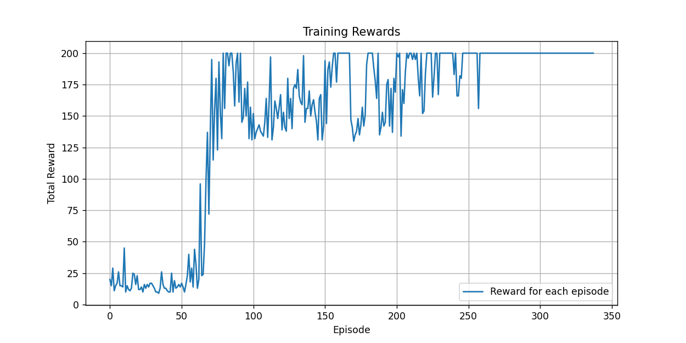
  - 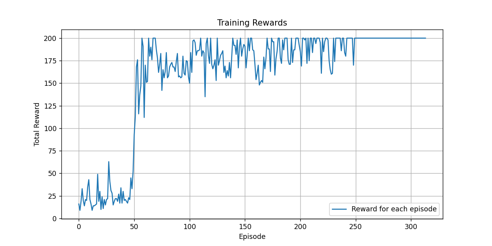
  - 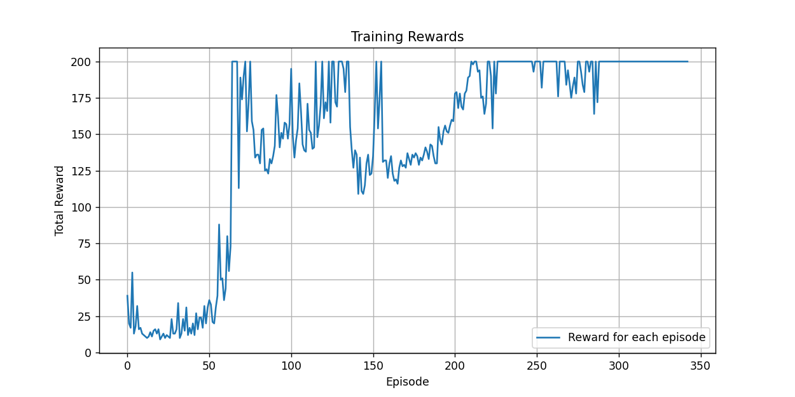
  - 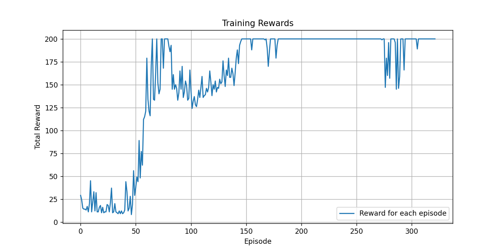
  - 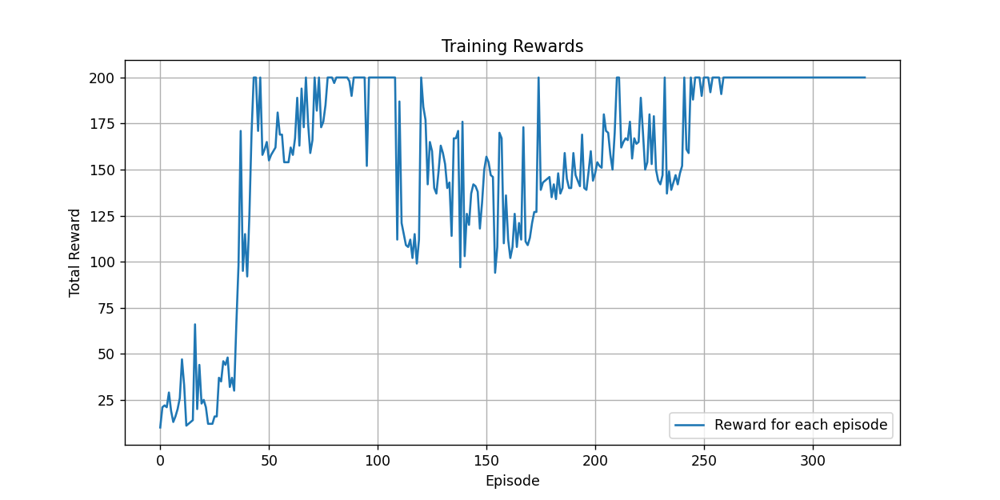
  - 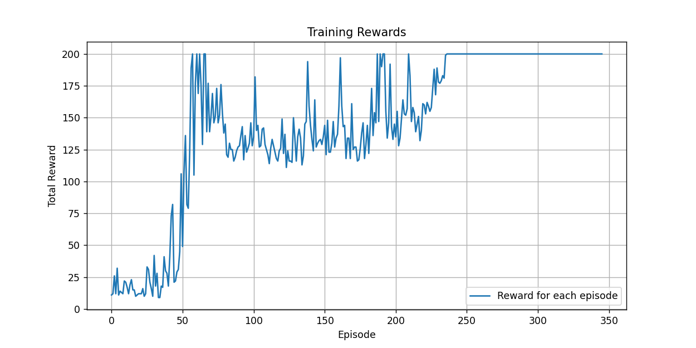
  - 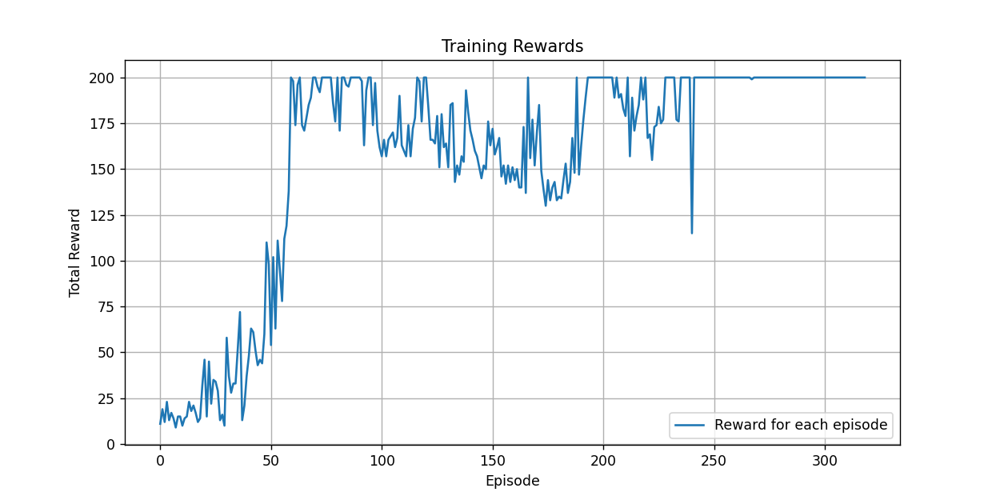
  - 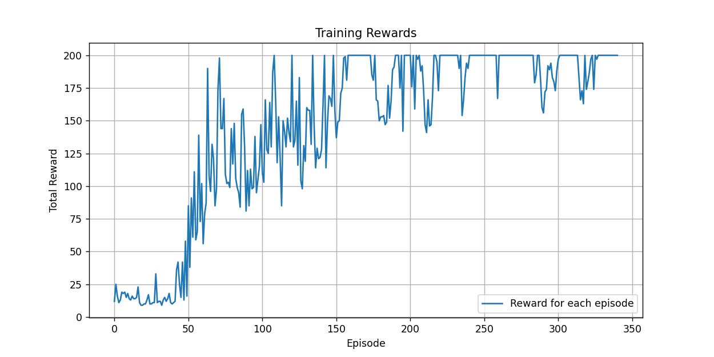
  - 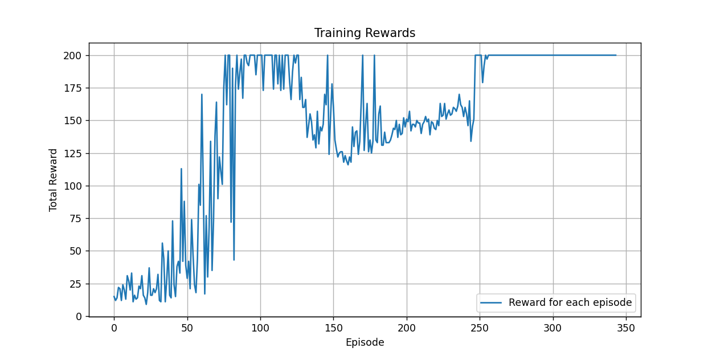
- 从图中可以看出，达到了训练目的，能够收敛到 200 reward 左右
#### 调参
> - 记录我参数调整过程
- 一开始我的参数设置为：（其他参数一致）
  - `n_frames=30000`，`epsilon_start=0.9`，`epsilon_end=0.05`，`epsilon_decay=1000`
  - 得到的 reward 曲线图如下：
    - 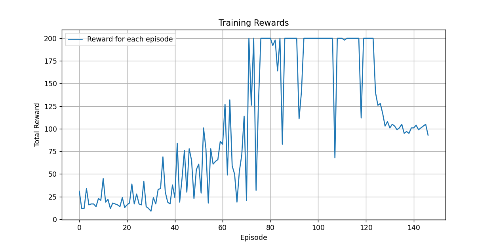
    - 发现短暂收敛到 200 左右后又开始下降，猜想应该是训练交互步数太少了，于是我想把训练帧数提高，以防出现“假收敛”
- 于是我将 `n_frames` 调整为 `100000`，其他参数不变，得到的 reward 曲线图如下：
  - 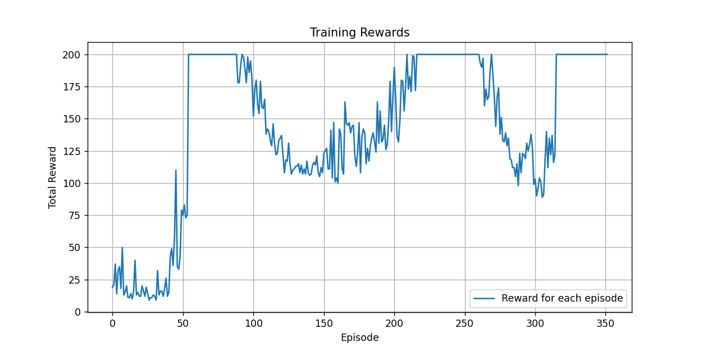
  - 发现稳定度很低，多次到达 200 左右后又下降，猜想可能是 `epsilon` 衰减太快了，于是我将 `epsilon_decay` 调整为 `10000`，然后将 `epsilon_end` 调整为 `0.01`，防止在后期有过度探索的情况
- 调整后发现有所改善，于是进行多次试验：↑ [实验结果](#实验结果)
### 四、参考文献
> - https://www.gymlibrary.dev/
> - https://www.gymlibrary.dev/environments/classic_control/cart_pole/


[^1]:优化1：正交初始化
[^2]:优化2：经验回放缓冲区
[^3]:优化3：指数衰减策略

